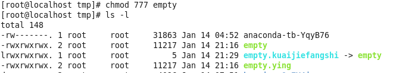
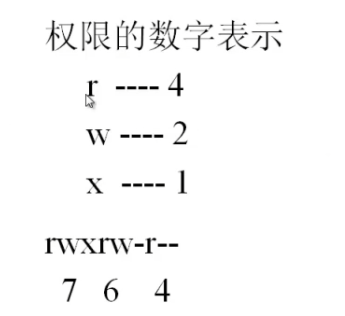
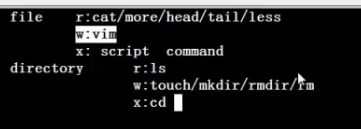

# 权限管理命令_chmod更改权限

原意:changethepermissionsmadeofafile

命令所在路径:/bin/chmod

执行权限:所有用户

语法:chmod{ugoa}{+-=}{rex}[文件或目录]

+表示增加权限,-表示减去权限

=表示让他的权限为….

[mode=42][文件或目录]

要添加多个用户的权限更改时,可以在同一条命令中将用户

用逗号分隔

-R(大写)递归修改

功能:改变文件或目录权限

更改文件权限的只有两个:root,所有者

 

下图:更改rgo的权限为7

 

但实际中权限用数字表示

 

 

 

 

 

 

 

 

 

|R|读权限|可以列出目录中的内容|
|---|---|---|
|W

|写权限|可以在目录中创建,删除文件|
|x|执行权限|可以进入目录|
可读,可写,不执行

420

