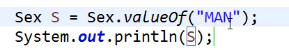
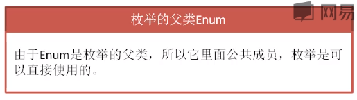

# 枚举  中篇

枚举表示一个事物的固定状态

在Jana中表示一种特殊的类,多个常量的集合

格式:

[修饰符]enum枚举的名称{

常量1,常量2,常量3...................

}

枚举不能创建对象,因为它在反编译中,构造器是私有化的

![package mei _ju; 
enum Sex{ 
MAN , FEMA L E , 
public class { 
public static void main(StringC] args) { 
System . out . pri ntIn (Sex .biantai . ordi nal()) ](images/ff88d545-0c9d-4cea-96e4-fb14a86681f9.png)创建一个Sex枚举,输出其中的Sex.biantai.ordinal()

则会输出其在枚举定义中的次序,枚举中的对象以0开始计数

枚举还可以用在switch中

将字符串MAN转为Sex得到枚举

并输出,

该字符串必须是枚举中的值,而且必须打""

