# 栈:数据结构,总结

程序:数据算法+算法:持续学习

栈:先进后出,后进先出(类似于桶的概念)

队列:先进先出(类似与管道的概念)(FIFO:first input first output)

喝多了吐就是栈,吃多了拉就是队列

为什么main方法先执行,最后结束?

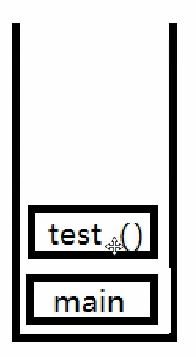

运行时先调用main,再调用其他方法,所以main方法最后出栈

如果方法之间互相调用.可能会造成栈溢出

栈:栈内存,主管程序的运行,生命周期和线程同步;

线程结束,栈内存就释放,对于站来说,不存在垃圾回收的问题,

一旦线程结束,栈就over

 

栈:8大基本类型+对象引用+实例的方法

栈运行原理:栈帧

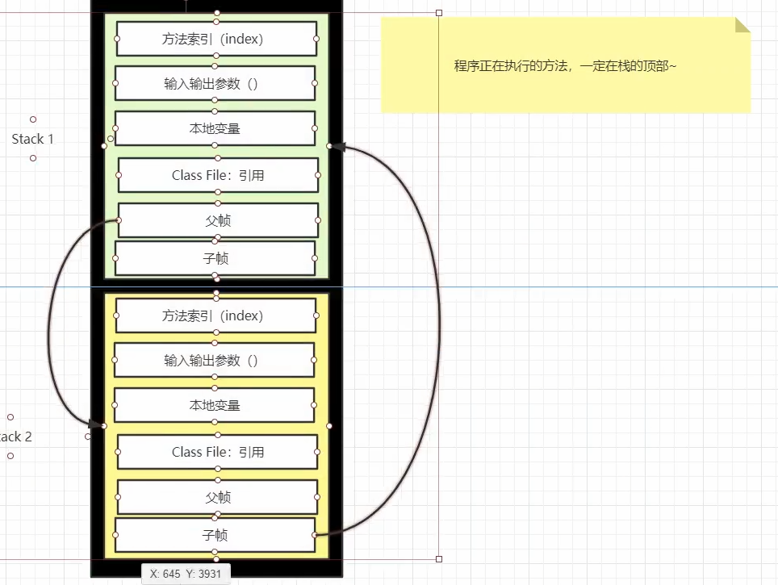

栈满了就会抛出StackOverflowError

栈+堆+方法区:交互关系

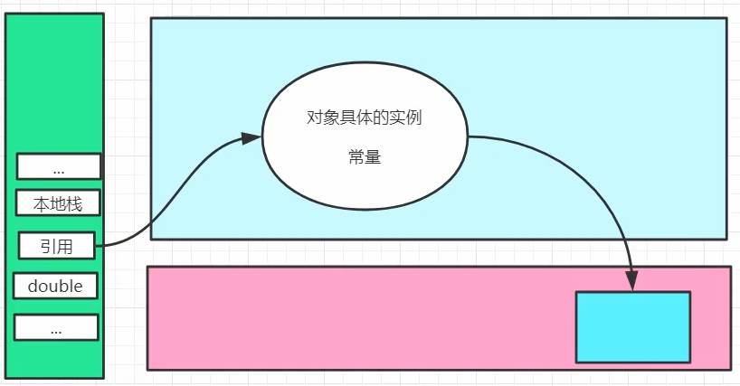 

 

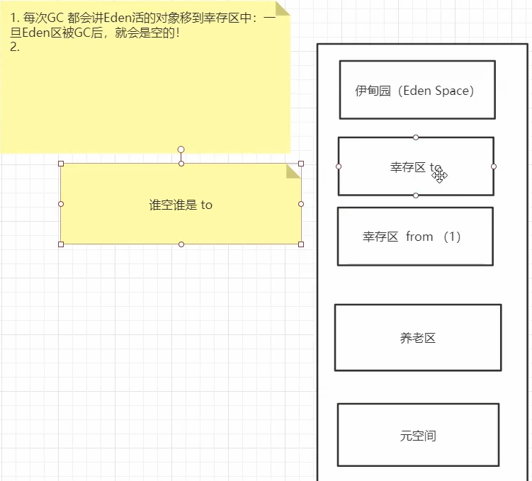 

当对象经历了十五次(默认次数,可以调)GC之后还没死,那么他会进入老年区

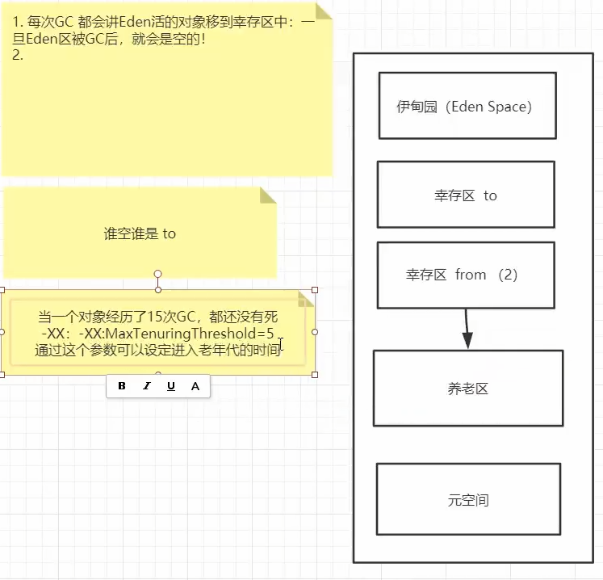 

复制算法:

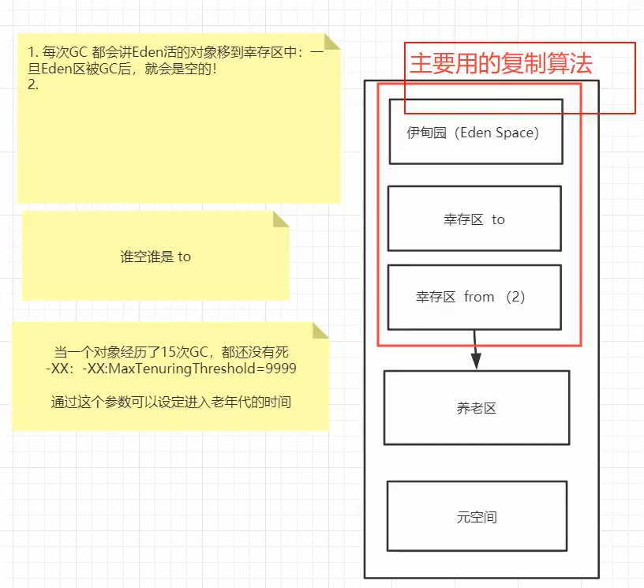 

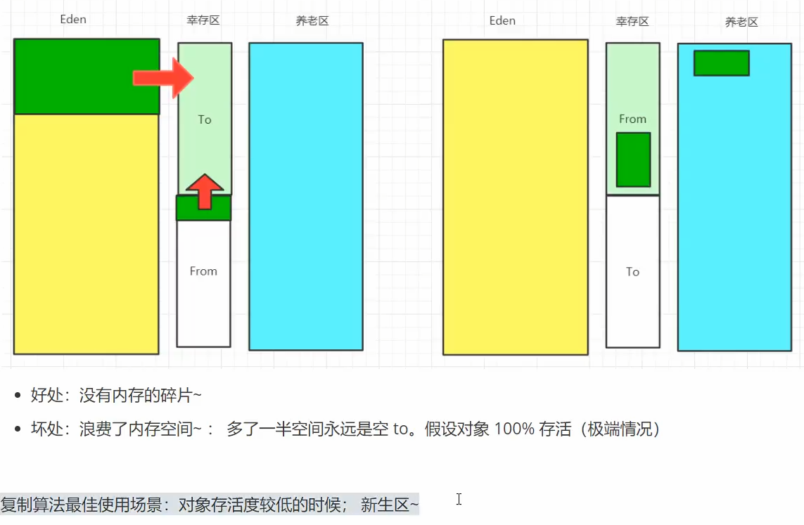 

 

标记清除:

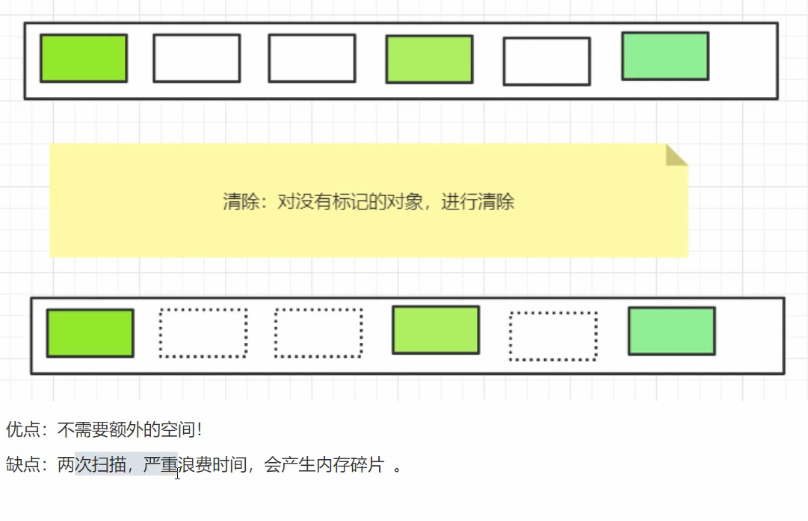标记压缩:

再次优化:

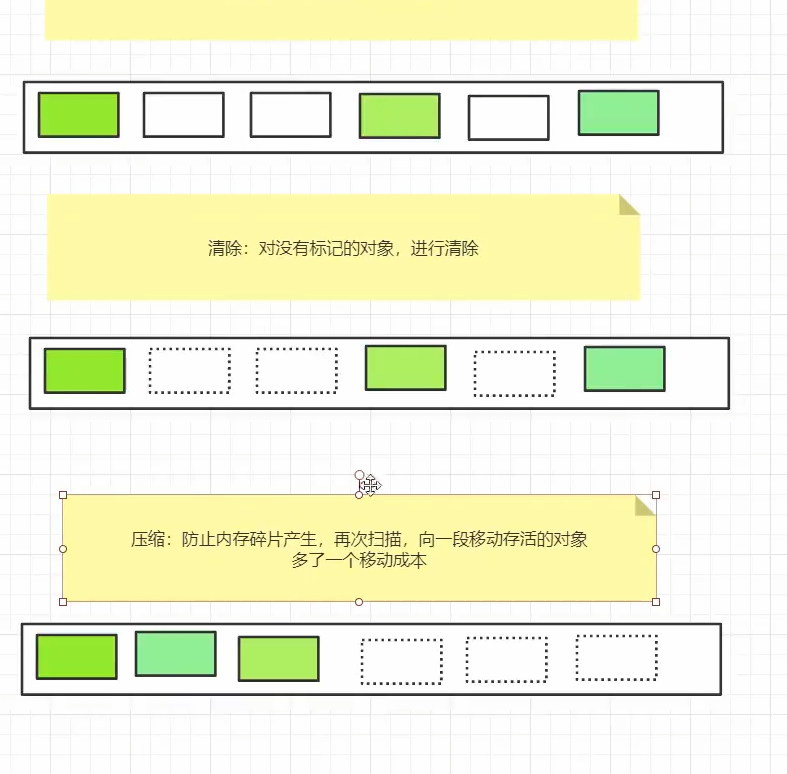 

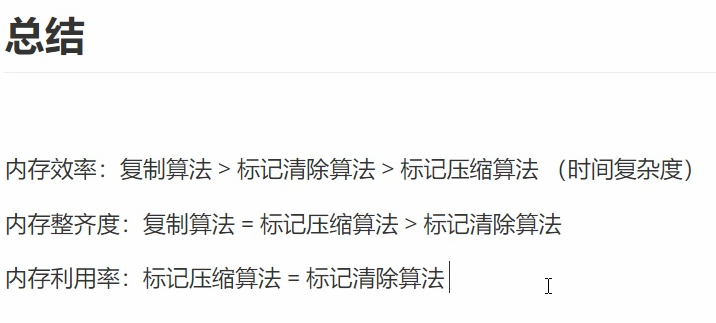 

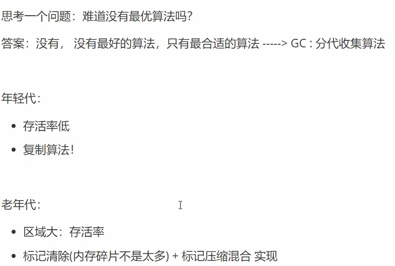

GC使用的是分代收集算法

 
