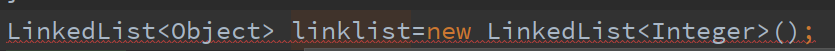

# 泛型

什么是泛型:

广泛通用的类型(一开始不确定是什么类型,在使用时才知道)

代码中的类型不确定,谁调用这个代码,谁就可以指明这个类型

在开始定义类的时候留一个插口

在创建对象时再去插入对应的类型

注意:

1.泛型前后类必须保持一致

2.从Java7开始泛型后面的(<>内的类型可以不写)可以不写

newLinkedList<>();被称为菱形(或钻石)语法

3.泛型是没有继承的(就这种错的

),前后必须保持一致

4.泛型其实是一个语法糖

 
 
 
