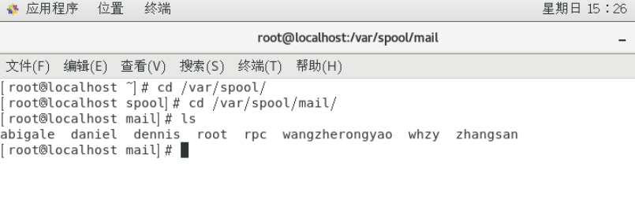

# 用户的家目录,邮箱,模板目录

普通用户:/home/用户名/,所有者和所属组都是此用户,权限是700

超级用户:/root/,所有者和所属组都是root用户,权限是550

把普通用户变为超级用户:改变用户的GIU即可,他的家目录不会改变,

用户的邮箱:

/var/spool/mail/用户名/

 

用户模板目录:

/etc/skel/

 

 

 

 

 

 

 

 

 
