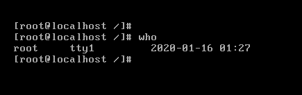
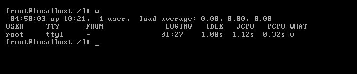
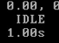
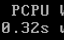
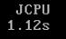

# 用户管理命令_who

路径:/usr/bin/who

权限:所有用户

语法:who

功能:查看登陆用户信息

范例:$who

用户名终端登陆时间ip地址

tty表示本地终端

pts表示远程(终端)登陆

本地登录不会写出ip地址,终端登录会写出ip地址

$w(获得更为详细的登陆情况)

第一个表示当前系统时间,

Uptime表示累计登录时间,

第三个表示当前有多少用户登录,

表示系统负载值

IDLE表示该用户空闲了多久

 

当前用户登陆过来占用cpu的时间

 

当前用户累计占用cpu的时间

 

当前用户的执行操作

 

 

 

 

 

 

 

 

