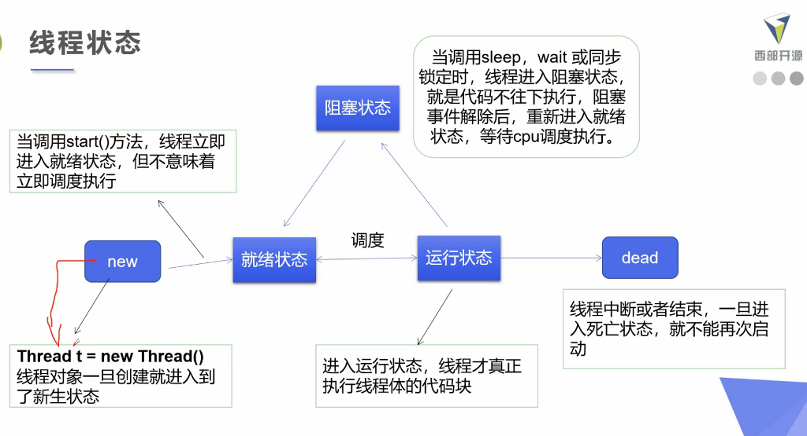

# 线程状态

 

|方法|说明|
|---|---|
|stePriority(int newPriority)|更改线程优先级|
|static void sleep(long millis)|在指定的毫秒数内让当前正在执行的程序休眠|
|void join()|等待该程序终止|
|static void yield()|暂停当前正在执行的线程对象,并执行其他线程|
|void interrupt()|中断线程,别用这个方式|
|boolean isAlive()|测试线程是否处于活动状态|

停止线程:

* 不推荐使用JDK提供的stop(),destroy()方法[已经废弃]
* 推荐线程自己停下来
* 建议使用一个标志位进行终止变量,当flag=false,则终止线程运行

线程休眠:

* sleep(时间)指当前线程阻塞的毫秒数
* sleep存在异常interruptedException
* sleep时间达到后线程进入就绪状态
* sleep可以模拟网络延时,倒计时等
* 每一个对象都有一个锁,sleep不会释放锁
线程礼让:

* 礼让线程,让当前正在执行的线程暂停,但不阻塞
* 将线程从运行状态转为就绪状态
* 让CPU重新调度,礼让不一定成功!看CPU心情
合并线程:

* join合并线程,待此线程执行完成后,再执行其他线程,其他线程阻塞
* 可以想象为插队
线程状态观测:

* Thread,State
* 线程状态:线程可以处于以下状态:

    * NEW:尚未启动的线程处于此状态
    * RUNNABLE:在Java虚拟机中执行的线程处于此状态
    * BLOCKED:被阻塞等待监视器锁定的线程处于此状态
    * WAITING:正在等带另一个线程执行动作达到指定等待时间的线程处于此状态
    * TERMINATED:正在等待另一个线程执行动作达到指定等待时间的线程处于此状态
    * TERMINATED:已退出的线程处于此状态

* 一个线程可以在给定时间点处于一个状态.这些状态是不反映任何操作系统线程状态的虚拟机状态.

* 线程优先级:

    * Java提供了一个线程调度器来监控程序中启动后进入就绪状态的所有线程,线程调度器按照优先级决定应该调度哪个线程来执行
    * 线程优先级用数字来表示,范围从1到10

        * Thread.MIN_PRIORITY=1;
        * Thread.MAX_PRIORITY=10;
        * Thread.NORM_PRIORITY=5;

    * 使用以下方式改变或者获取优先级:

        * getPriority()setPriority(int xxx)
        * 线程高到时不一定先执行(还是要看CPU心情)

    * 线程优先级默认为5,main线程也是5

* 守护(daemon)线程:

    * 线程分为用户线程和守护线程
    * 虚拟机必须确保用户线程执行完毕
    * 虚拟机不用等待守护线程执行完毕
    * 如,后台记录操作日志,监控内存,垃圾回收等待

