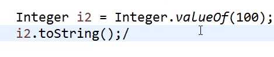
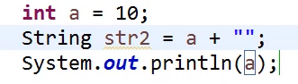
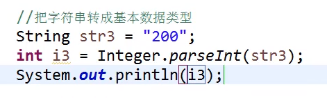
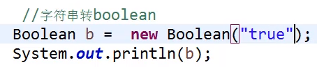
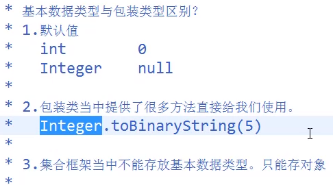

# 转类型11月25号

把一个包装类对象转成字符串

之后需要一个对象类接收i2:

String   i3=i2.toString();

无论是什么类型,调用tostring都能转为字符串

将基本数据类型转为字符串

数字和任何字符串拼接就变成了字符串

将字符串转为基本数据类型

该字符串中不能有子母,

字符串转Boolean类型,除了给的b的值为true之外的值输出都是false

* 基 本 数 据 类 型 与 包 装 类 型 区 别 ？ 

* 1 ． 默 认 值 
int 
Integer 
null 
* 2 ． 包 装 类 当 中 提 供 了 很 多 方 注 直 接 给 我 们 使 用 ； 
.toBinaryString(5) 
Integer 
* 3 ． 集 合 框 架 当 中 不 能 存 放 基 本 数 据 类 型 。 只 能 存 对 象 

