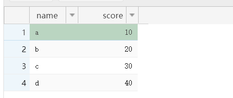
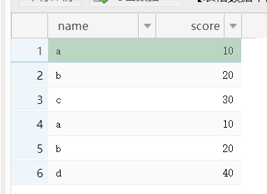
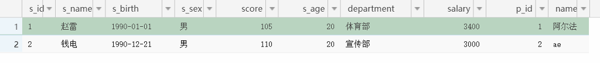
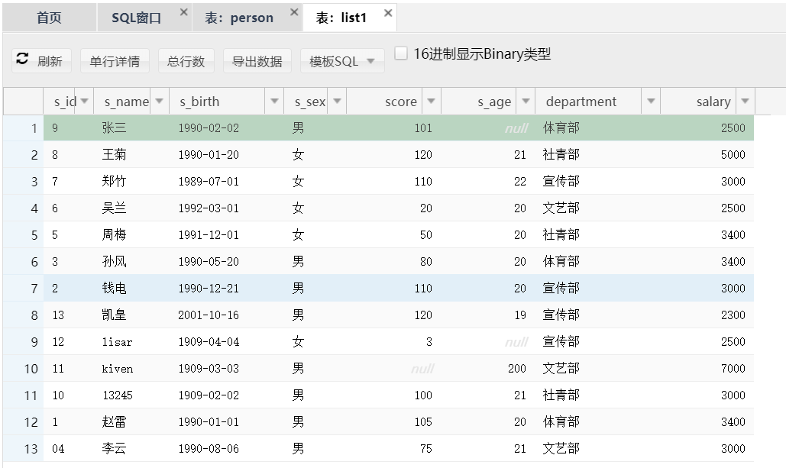
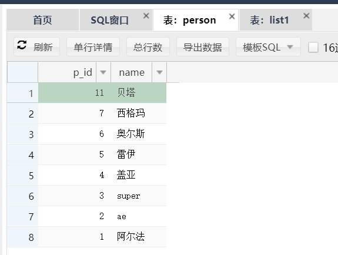
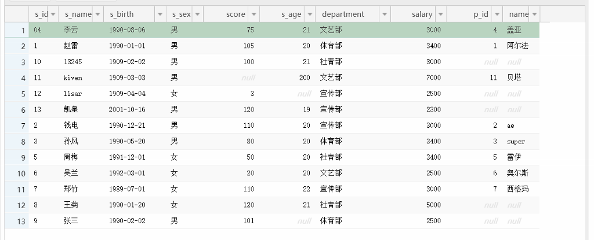
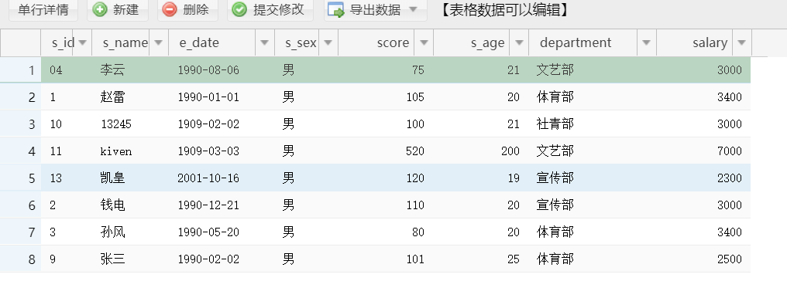

# 进阶一

表之间的关系:

* 一对一(例子):

    * CREATE TABLE car(c_name VARCHAR(10),color VARCHAR(10),pid int ,CONSTRAINT c_p_fk FOREIGN KEY (pid) REFERENCES person(p_id));
    * INSERT INTO car (c_name,color,pid)VALUES("bmw","red",1),("bmw","red",2);

* 一对多
* 多对多(例子):

    * CREATE TABLE teach(t_id int PRIMARY KEY ,name VARCHAR(50) );
    * CREATE TABLE stu(s_id int PRIMARY KEY ,name VARCHAR(50) );
    * CREATE TABLE tea_stu_rel(t_id int ,s_id int);
    * ALTER TABLE tea_stu_rel add CONSTRAINT FOREIGN KEY(t_id) REFERENCES teach(t_id);
    * ALTER TABLE tea_stu_rel add CONSTRAINT FOREIGN KEY(s_id) REFERENCES stu(s_id);

* 为什么要拆分表?避免大量冗杂数据的出现

多表查询:

* 合并结果集:

    * 什么是合并结果集:

        * 合并结果集就是把两个select语句的查询结果合并到一起

    * 合并结果集的两种方式:

        * UNION

            * 合并时取出重复记录

        * UNION ALL
        * 合并时不会去除相同记录

    * 格式:

        * UNION:

            * select * from表1 union slect *from表2;

                * 例子:

                    * 建表语句:

                        * CREATE TABLE A(name VARCHAR(10),score int );
                        * CREATE TABLE B(name VARCHAR(10),score int );
                        * INSERT INTO A VALUES('a',10),('b',20),('c',30);
                        * INSERT INTO B VALUES('a',10),('b',20),('d',40);

                    * SELECT *FROM A union SELECT *FROM B;

* SELECT *FROM A union all SELECT *FROM B; * 

* * select * from表1 union all select * from表2;
    * 示例:
    * 注意事项:
    
        * 被合并的两个结果:列数,列类型必须相同

* 连接查询:

    * 什么是连接查询:

        * 也叫做跨表查询,需要关联多个表进行查询

    * 什么是笛卡尔积:

        * 假设集合A={a,b},集合B={0,1,2}
        * 则两个集合的笛卡尔积为{(a,0),(a,1),(a,2),(b,0),(b,1),(b,2)}
        * 可以扩展到多个集合的情况

    * 同时查询两个表,出现的就是笛卡尔集结果
    * 查询时给表取别名:(略)
    * 多表联查,如何保证数据正确:

        * 在查询时要把主键和外键保持一致:

            * SELECT * FROM `list1` ,person WHERE s_id = p_id;

        * 主表当中的数据参照字表当中的数据
        * 原理:逐行判断,相等的留下,不相等的不要

    * 根据连接方式分类:

        * 内连接:

            * 等值连接:

                * 两个表同时出现的id号(值)才显示

                    * inner可以省略不写:
                    * SELECT * FROM list1INNER JOINpersononlist1.`s_id` = `person` .p_id;
* 

* 与多表联查约束外键是一样,只是写法改变了
* ON后面只写主外键
* 如果还有条件直接在后面写where:
* SELECT * FROM list1INNER JOINpersononlist1.`s_id` = `person` .p_idWHEREp_id < 3;
                * 多表联查后面还有条件就直接写and:
                    * SELECT * FROM list1INNER JOINpersononlist1.`s_id` = `person` .p_idWHEREp_id < 3ANDs_sex="男";
                * 多表连接:
                    * 99连接法(先查询多个表,再利用中间表查出一行的信息)
                    * 使用内联查询(多个join on)
* 非等值连接:
* 自然连接
* 外连接:
* 左外连接(左连接):
* 左边的表里面信息全部显示,右边的数据只显示符合条件的
* SELECT * FROM list1LEFT OUTER  JOINperson on list1.`s_id` = `person`.p_id;
* 建表:

* 结果:
* 

* 使用内连接时,周七不会查出来,缺考了,把所有考试过的学生分数查出来
	* 使用左连接查询所有学生及学生的考试分数
	* 右外连接(右连接):
  
* 右边的表里面信息全部显示,左边的数据只显示符合条件的
* SELECT * FROM list1right OUTER  JOINperson on list1.`s_id` = `person`.p_id;

* 自然连接:
	* 笛卡尔集的形式(注意要各有一列数据类型相同,数据相等):
    * select * from stunaturaljoinscore;
* 子查询:

    * 什么是子查询:

        * 一个select语句中包含另外的select语句:

            * 例如:

                * 查询与张三统一性别的所有人
                * SELECT * FROM emp WHERE s_sex = (SELECT s_sex FROM emp WHERE s_name = '张三');
                * 结果:
                  

* 有两个或以上select语句的就是子查询
    * 子查询出现的位置:
    
        * where后,把select查询结果当做另一个select的条件值
        * from之后,把查询结果当做一个新表
    
    * 示例表
    * 使用

* 自连接:

    * 是搜索一个表,为其起多个昵称并进行筛选

 

 

 

