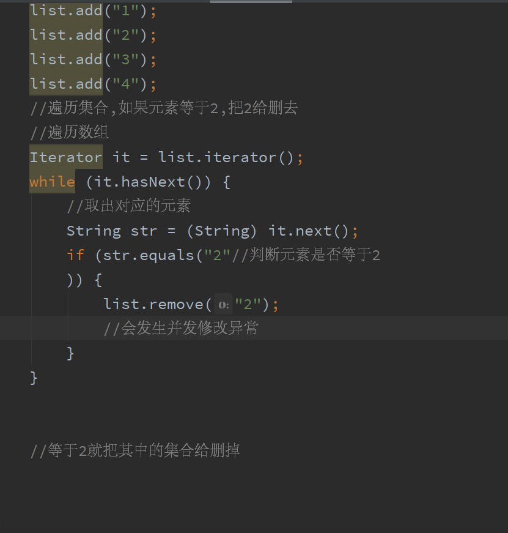

# 集合-List

![package 
Simport java. util. Arrayl--ist; 
import java. util. Iterator; 
import java. util. List; 
public class List 
void main(Stri ngC] args) 
public static 
List list = 
new ArrayList() ; 
list. )  

  

输出有:

这个是并发修改异常

//因为在迭代过程中是不允许直接修改其集合的结构的

详情见下一张笔记

