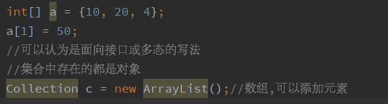
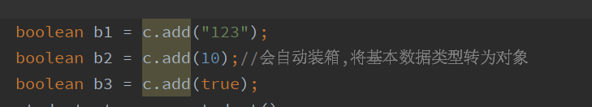
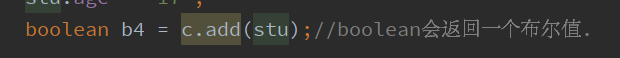
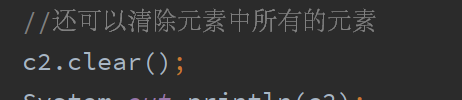

# 集合_ArrayList

//List中可以添加重复元素

//ArrayList的爷爷类里面覆盖了toString方法,可以直接打印内容

//因为set中是不能添加重复元素,添加就会报告false

格式:

集合名.(元素);

其返回的是一个布尔值

 

 
 
  

//List中add的返回值都是true;在今后开发当中不会接收结果

System.out.println(c);//ArrayList的爷爷类里面覆盖了toString方法,(c为创建的一个集合)

如果一个集合中加入了类student,并且定义了student的一个年龄,那么要输出其年龄,则需要在stuent中生成toString()才会输出其年龄

详情见(Java文件,下一张笔记):Collectiong_1

//可以移除指定的元素remove(对象不是处于遍历状态)

如:

集合名称.remove("元素");

size可以返回集合其中所含的数量:

 
System.out.println(集合名称.size(););

