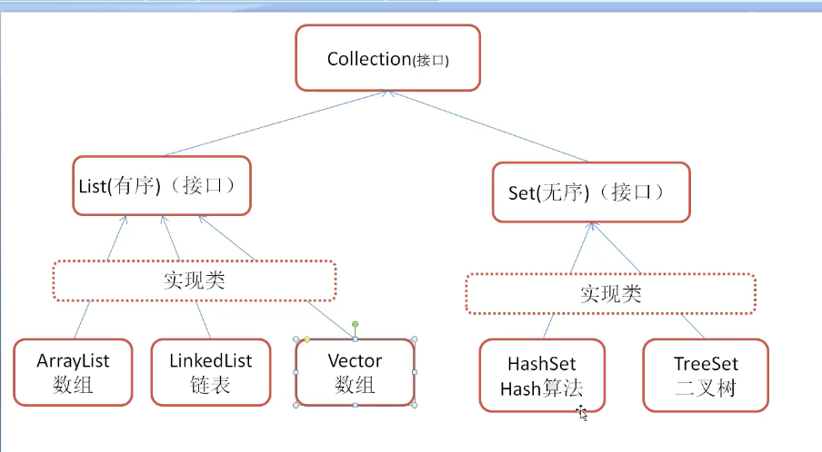
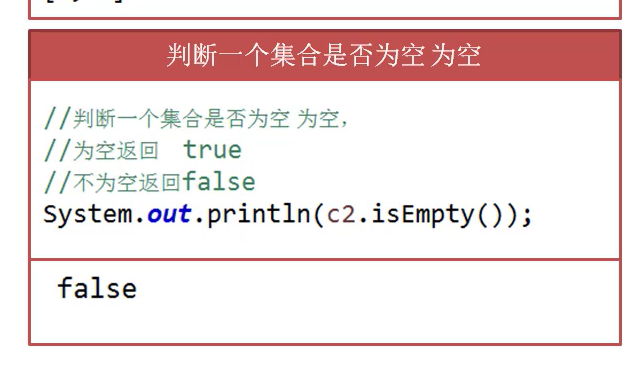
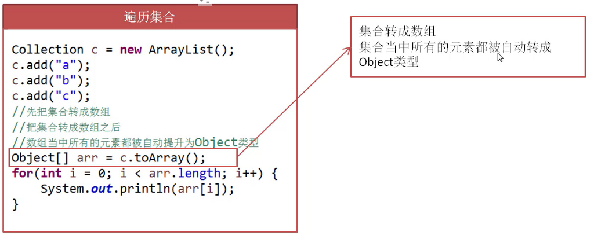
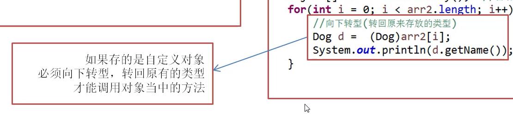
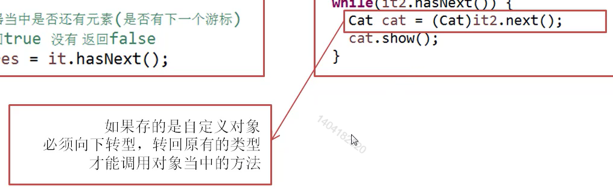

# 集合_什么是集合

集合:用来存放数据的一个容器

数组的不足:长度是固定的,不能再去添加元素了

 
 
Java集合类:

集合的长度是可以随元素增加而增加,

能存放任意元素

 
数组和集合的区别:

1.数组只能存基本数据类型和引用数据类型

2.集合只能存引用和数据类型,直接放也会自动帮你装箱

(将基本数据类型转化为对象)_

3.数组长度固定,而集合的长度可变

 
 
什么时候使用数组,什么时候使用集合类:

1.如果元素个数是固定的,推荐使用数组

2.如果元素个数不是固定的,推荐使用集合

 
  

  

  

  

 

