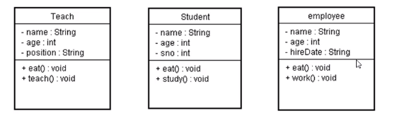
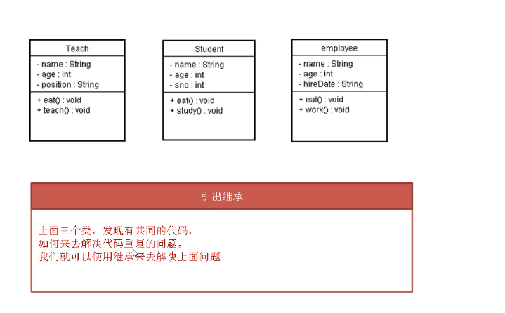

# 面向对象

面向对象

封装

面向对象三大特征之一

1.把对象的状态和行为看成一个统一的整体,将字段和方法放到一个类中

2.信息隐藏:把不需要让外界知道的信息隐藏起来

尽可能隐藏对象实现功能细节,向外暴露方法,保证外界安全访问功能;

封装的好处:

面向对象三大特征之一

1.保证数据的安全

2.提高组建的复用性

继承:

专门解决代码重复的问题

多态

InkNode is not supported

  

