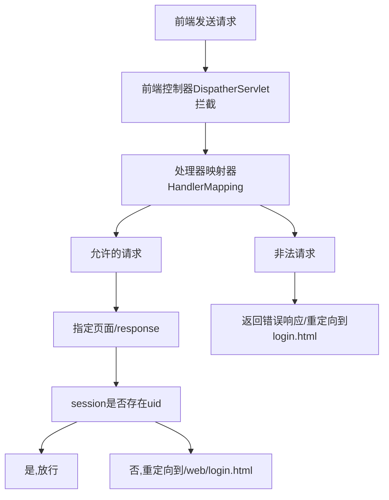

> 电脑商城实训

联合国大队
犯大吴疆土者,盛必击而破之

<font size="5px">余昊泽:项目主讲</font>  
<font size="5px">李冠英:文稿编写</font>  
<font size="5px">张嘉凯:代码模块  </font>  
<font size="5px">闵瑞祥:资料收集  </font>  
<font size="5px">刘康讯:资料修改  </font>  
<font size="5px">胡庆森:资料检阅  </font>  
<font size="5px">耿志杰:资料整合</font>  

---
#### 项目结构  


---
#### 前端技术栈

- bootstrap
- jquery
- ajax

没什么好说的,这里是根据不同的功能写在不同的js文件中
大部分为静态页面,页面中的请求,例如修改头像,修改密码等等操作,通过ajax与后端进行交互


---
#### 后端技术栈:

##### 过滤器(;拦截器)

springMVC中通过`<mvc:interceptors>`标签配置

```xml
<!--配置拦截器-->  
<mvc:interceptors>  
    <mvc:interceptor>  
        <!--这里拦截全部请求-->  
        <mvc:mapping path="/**"/>  
        <!--允许的请求-->
        <mvc:exclude-mapping path="/bootstrap3/**"/>  
        <mvc:exclude-mapping path="/css/**"/>  
        <mvc:exclude-mapping path="/js/**"/>  
        <mvc:exclude-mapping path="/images/**"/>  
        <mvc:exclude-mapping path="index.html"/>  
        <mvc:exclude-mapping path="/web/login.html"/>  
        <mvc:exclude-mapping path="/web/register.html"/>  
        <mvc:exclude-mapping path="/web/index.html"/>  
        <!--放行注册，登陆的请求-->  
        <mvc:exclude-mapping path="/user/reg"/>  
        <mvc:exclude-mapping path="/user/login"/>  
        <!--将拦截器注册到Spring容器中-->  
        <bean class="com.qf.interceptor.LoginInterceptor"></bean>  
    </mvc:interceptor>  
</mvc:interceptors>
```

---

- 防止一些页面通过浏览器可以直接访问,指定服务器端部分资源可以被公共访问到
- 在项目中,拦截器LoginInterceptor中的逻辑通过session中的`uid`是否存在来判断用户是否登录
- 如果登录,则可以访问后续用户想要访问的页面如:查看单个商品,
- 前端页面需要的资源是从开放的静态资源目录中获取的

---

##### Controller层

springmvc中请求这里根据不同的功能/页面区分不同的一级路由,例如:

```java
@RequestMapping("/user")
...
@RequestMapping("address")
...
@RequestMapping("district")
```

---
同一模块下的功能使用二级路由来设置请求,例如:
```java
@RequestMapping("district")  
public class TDistrictController extends BaseController {  
    @Autowired  
    private TDistrictService tDistrictService;  
    @RequestMapping("getProvince")  
    public JsonResult<List<TDistrict>> getProvince(String parent){  
        List<TDistrict> province = tDistrictService.getProvince(parent);  
        return new JsonResult<List<TDistrict>>(OK,province);  
    }  
    @RequestMapping("getCity")  
    public JsonResult<List<TDistrict>> getCity(String parent){  
        List<TDistrict> province = tDistrictService.getCity(parent);  
        return new JsonResult<List<TDistrict>>(OK,province);  
    }  
}
```

使代码结构合理

---

##### 错误统一处理

对于用户操作错误,这里后端会抛出指定的错误信息给前端,方便我们错误的定位与处理
```java
//地址不存在异常  
public class AddressNotFoundException extends TAddressException {  
    public AddressNotFoundException() {  
        super();  
    }  
    public AddressNotFoundException(String message) {  
        super(message);  
    }  
    public AddressNotFoundException(String message, Throwable cause) {  
        super(message, cause);  
    }  
    public AddressNotFoundException(Throwable cause) {  
        super(cause);  
    }  
    protected AddressNotFoundException(String message, Throwable cause, boolean enableSuppression, boolean writableStackTrace) {  
        super(message, cause, enableSuppression, writableStackTrace);  
    }  
}
```

---

##### service

- 这里service主要对于数据逻辑的操作,对UUID加密,密码的加盐等等
```java
private String getMD5Password(String password,String salt){  
    /** 进行3次加密  
    **/  
    for (int i = 0; i < 3; i++) {  
        /*在密码前后各拼接一个盐值  
        * (salt + password + salt).getBytes()将字符串转换byte数组  
        * */        password = DigestUtils.md5DigestAsHex((salt + password + salt).getBytes()).toUpperCase();  
    }  
    return password;  
}
```
- 数据操作之后传递给mapper层进行持久化

---

- 通过mapper层返回的信息判断respone传递成功还是失败
```java
@Override  
public void changeAvatar(Integer uid, String modifiedUser, Date modifiedTime, String avatarPath) {  
    int flag = tUserMapper.changeAvatar(uid, modifiedUser, modifiedTime, avatarPath);  
    if(flag!=1){  
        throw new UpdateException("修改头像时产生未知的异常");  
    }  
}
```

---

##### mapper层
映射到对应的xml,通过编写的sql语句,查询并返回指定数据

```java
//根据用户id查询当前用户收货地址的数量  
Integer findByUid(Integer uid);  
  
Integer insert(TAddress tAddress);
```
---
```java
<!--public int insert(TUser tUser);-->  
<insert id="insert">  
    insert into t_user (  
    username,password,salt,  
    is_delete,created_user,  
    created_time,modified_user,modified_time)  
    values  
    (#{username},#{password},#{salt},  
    #{isDelete},#{createUser},#{createTime}  
    ,#{modifiedUser},#{modifiedTime})  
</insert>
```

---

> 谢谢观看


