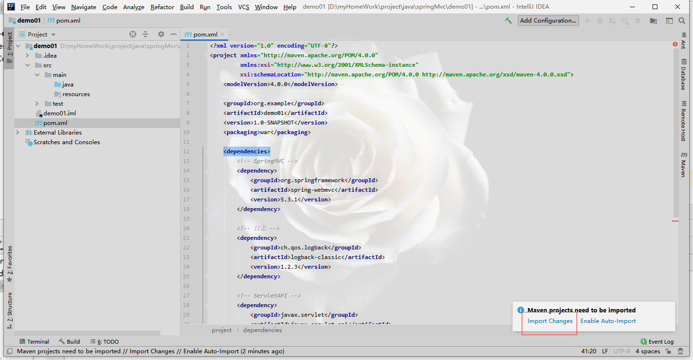
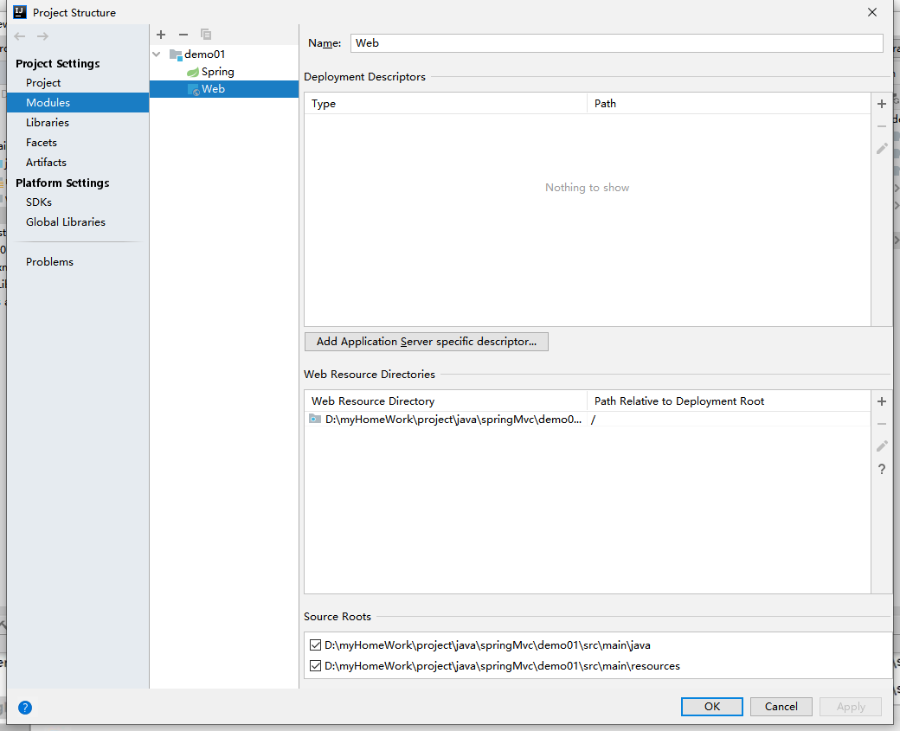
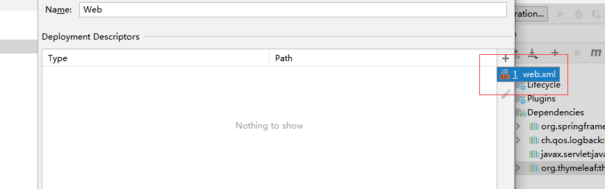
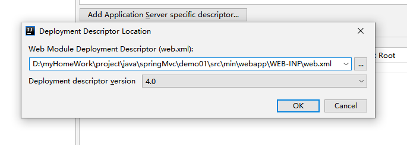
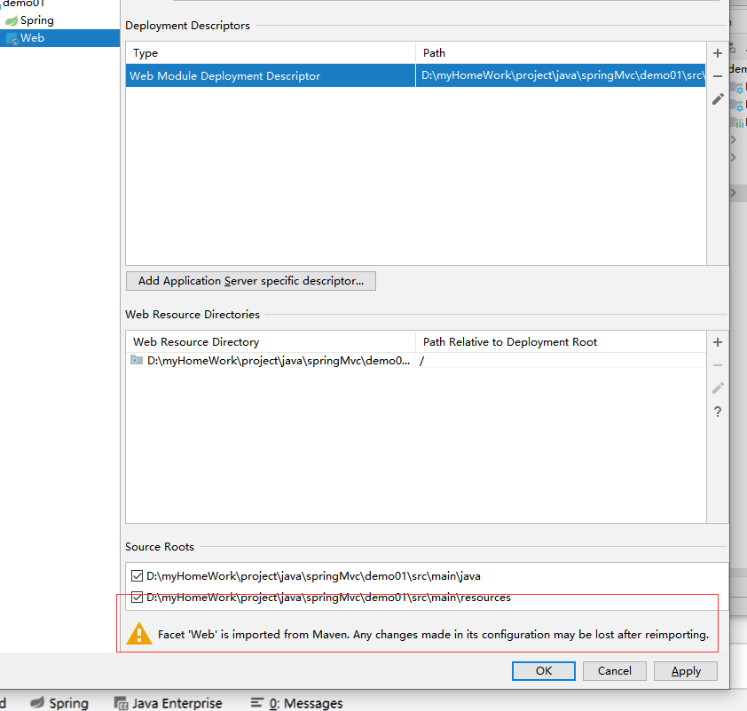
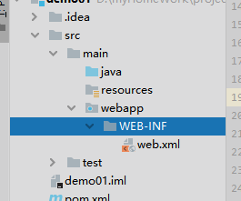
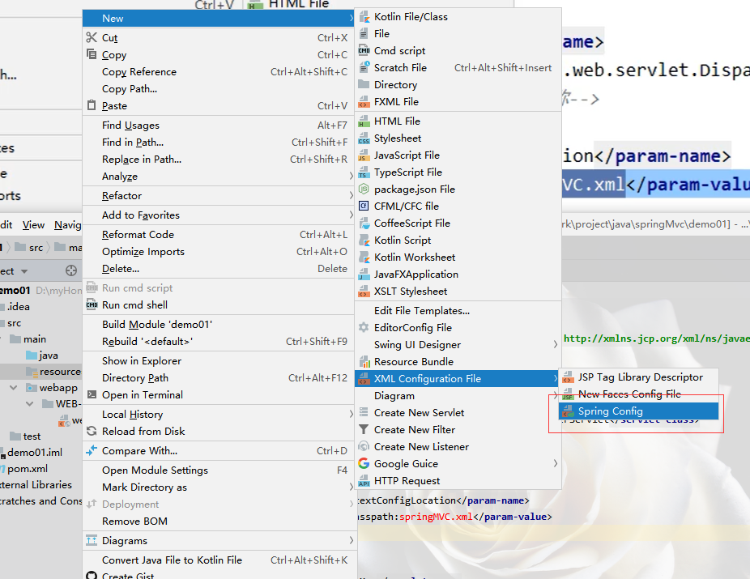
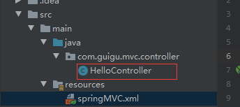
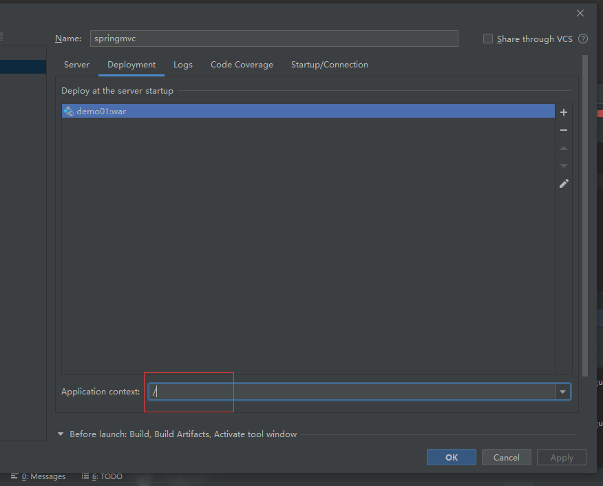

### 配置web模块

#### 修改打包方式

创建了maven项目,这里手动导入web模块:
修改打包方式为war包:

```xml
<packaging>war</packaging>
```

添加依赖:

```xml
<dependencies>
    <!-- SpringMVC -->
    <dependency>
        <groupId>org.springframework</groupId>
        <artifactId>spring-webmvc</artifactId>
        <version>5.3.1</version>
    </dependency>

    <!-- 日志 -->
    <dependency>
        <groupId>ch.qos.logback</groupId>
        <artifactId>logback-classic</artifactId>
        <version>1.2.3</version>
    </dependency>

    <!-- ServletAPI -->
    <dependency>
        <groupId>javax.servlet</groupId>
        <artifactId>javax.servlet-api</artifactId>
        <version>3.1.0</version>
        <scope>provided</scope>
    </dependency>

    <!-- Spring5和Thymeleaf整合包 -->
    <dependency>
        <groupId>org.thymeleaf</groupId>
        <artifactId>thymeleaf-spring5</artifactId>
        <version>3.0.12.RELEASE</version>
    </dependency>
</dependencies>
```

然后手动导入一下:



#### 添加web.xml

为项目添加web.xml:

打开项目结构,选择web:





这里的路径要写对:



由于文件不存在,会报错,这里再点击apply:



然后他就会自动生成:



#### DispatcherServlet
> 注册SpringMVC的前端控制器DispatcherServlet

- 默认配置方式

此配置作用下，SpringMVC的配置文件默认位于WEB-INF下，默认名称为-servlet.xml，例如，以下配置所对应SpringMVC的配置文件位于WEB-INF下，文件名为springMVC-servlet.xml

```xml
<!-- 配置SpringMVC的前端控制器，对浏览器发送的请求统一进行处理 -->
<servlet>
    <servlet-name>springMVC</servlet-name>
    <servlet-class>org.springframework.web.servlet.DispatcherServlet</servlet-class>
</servlet>
<servlet-mapping>
    <servlet-name>springMVC</servlet-name>
    <!--
        设置springMVC的核心控制器所能处理的请求的请求路径
        /所匹配的请求可以是/login或.html或.js或.css方式的请求路径
        但是/不能匹配.jsp请求路径的请求
    -->
    <url-pattern>/</url-pattern>
</servlet-mapping>
```

> 但是,我们的配置文件在开发中应该统一放在resources文件夹下面,为不是在WEB-INF.xml中,所以下面有另一种配置方式:

- 扩展配置方式

可通过init-param标签设置SpringMVC配置文件的位置和名称，通过load-on-startup标签设置SpringMVC前端控制器DispatcherServlet的初始化时间

```xml
<!-- 配置SpringMVC的前端控制器，对浏览器发送的请求统一进行处理 -->
<servlet>
    <servlet-name>springMVC</servlet-name>
    <servlet-class>org.springframework.web.servlet.DispatcherServlet</servlet-class>
    <!-- 通过初始化参数指定SpringMVC配置文件的位置和名称 -->
    <init-param>
        <!-- contextConfigLocation为固定值 -->
        <param-name>contextConfigLocation</param-name>
        <!-- 使用classpath:表示从类路径查找配置文件，例如maven工程中的src/main/resources -->
        <param-value>classpath:springMVC.xml</param-value>
    </init-param>
    <!-- 
 		作为框架的核心组件，在启动过程中有大量的初始化操作要做
		而这些操作放在第一次请求时才执行会严重影响访问速度
		因此需要通过此标签将启动控制DispatcherServlet的初始化时间提前到服务器启动时
	-->
    <load-on-startup>1</load-on-startup>
</servlet>
<servlet-mapping>
    <servlet-name>springMVC</servlet-name>
    <!--
        设置springMVC的核心控制器所能处理的请求的请求路径
        /所匹配的请求可以是/login或.html或.js或.css方式的请求路径
        但是/不能匹配.jsp请求路径的请求
    -->
    <url-pattern>/</url-pattern>
</servlet-mapping>
```

然后在resources下新建xml文件,但这里并不是直接新建xml文件



这里我新建的是,不是圈起来的java,是下面那个xml



为其添加注释:

```java
package com.guigu.mvc.controller;

import org.springframework.stereotype.Controller;

//使用注解将其标识为控制器,注释之后还需要扫描组件
@Controller
public class HelloController {

}
```

配置扫描,在springMVC.xml中添加:

```xml
    <!-- 自动扫描包 -->
    <context:component-scan base-package="com.guigu.mvc.controller"></context:component-scan>
```

和:

```xml
 <!-- 配置Thymeleaf视图解析器 -->
    <bean id="viewResolver" class="org.thymeleaf.spring5.view.ThymeleafViewResolver">
        <!--设置优先级-->
        <property name="order" value="1"/>
        <property name="characterEncoding" value="UTF-8"/>
        <property name="templateEngine">
            <bean class="org.thymeleaf.spring5.SpringTemplateEngine">
                <property name="templateResolver">
                    <bean class="org.thymeleaf.spring5.templateresolver.SpringResourceTemplateResolver">

                        <!-- 视图前缀 -->
                        <property name="prefix" value="/WEB-INF/templates/"/>

                        <!-- 视图后缀 -->
                        <property name="suffix" value=".html"/>
                        <property name="templateMode" value="HTML5"/>
                        <property name="characterEncoding" value="UTF-8"/>
                    </bean>
                </property>
            </bean>
        </property>
    </bean>

    <!--
       处理静态资源，例如html、js、css、jpg
      若只设置该标签，则只能访问静态资源，其他请求则无法访问
      此时必须设置<mvc:annotation-driven/>解决问题
     -->
    <mvc:default-servlet-handler/>

    <!-- 开启mvc注解驱动 -->
    <mvc:annotation-driven>
        <mvc:message-converters>
            <!-- 处理响应中文内容乱码 -->
            <bean class="org.springframework.http.converter.StringHttpMessageConverter">
                <property name="defaultCharset" value="UTF-8"/>
                <property name="supportedMediaTypes">
                    <list>
                        <value>text/html</value>
                        <value>application/json</value>
                    </list>
                </property>
            </bean>
        </mvc:message-converters>
    </mvc:annotation-driven>
```

要注意这里`配置Thymeleaf视图解析器`中设置了html页面的前缀:`/WEB-INF/templates/`

那么就需要在WEB-INF下新建templates来存放你的html文件

### 通过thymeleaf解析路径

在项目中我们有自己的上下文路径:



这里的字符串可能会改变,那么在html页面上我们要使用a链接就必须写他的上下文路径,但是它是可变的

这时就可以使用thymeleaf来帮助我们自动解析他的路径:

```html
<!DOCTYPE html>
<html lang="en" xmlns:th="http://www.thymeleaf.org">
<head>
    <meta charset="UTF-8">
    <title>index</title>
</head>
<body>
<h1>首页</h1>
<!--
这里使用thymeleaf语法,会自动将我们的路径解析为对应的上下文路径
-->
<a th:href="@{/target}">target</a>

</body>
</html>
```

使用thymeleaf的html文件要注意它的命名空间,在头部要有这一句:

```html
<html lang="en" xmlns:th="http://www.thymeleaf.org">
```


