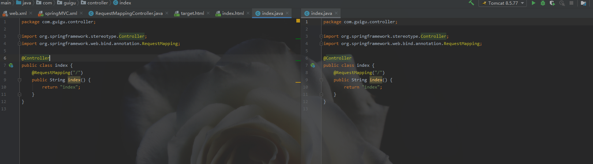
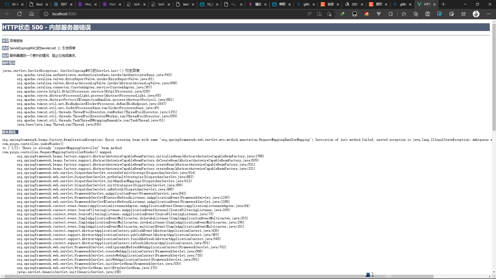
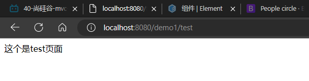

### 1.不可以注册多个映射:

例如在下面两个mapping中注册同一个`/`的路径映射,会报错:





### 2.如果想添加二级路由:

在一个mapping中添加耳机路由:

```java
package com.guigu.controller;

import org.springframework.stereotype.Controller;
import org.springframework.web.bind.annotation.RequestMapping;

@Controller
@RequestMapping("/demo1")
public class RequestMappingController {
    @RequestMapping("/test")
    public String test() {
        return "test";
    }
}
```

在index页面中通过a标签访问:

```html
<!DOCTYPE html>
<html lang="en" xmlns:th="http://www.thymeleaf.org">
<head>
    <meta charset="UTF-8">
    <title>首页</title>
</head>
<body>
<a th:href="@{/demo1}">demo1</a>
<br>
<a th:href="@{/demo1/test}">test</a>

</body>
</html>
```

此时是只有第二个a标签是可以成功访问到目标页面的:



其实这个就是:

> @RequestMapping注解的位置

@RequestMapping标识一个类：设置映射请求的请求路径的初始信息

@RequestMapping标识一个方法：设置映射请求请求路径的具体信息

```java
@Controller
@RequestMapping("/test")
public class RequestMappingController {

	//此时请求映射所映射的请求的请求路径为：/test/testRequestMapping
    @RequestMapping("/testRequestMapping")
    public String testRequestMapping(){
        return "success";
    }
}
```

### 3.RequestMapping

#### 3.1RequestMapping的value

用来匹配多个请求地址

在`RequestMapping`注解中,可以传入多个value,从而匹配多个请求:

```java
@Controller
@RequestMapping(value = {"/demo1", "/demo2", "demo3"})
public class RequestMappingController {
    @RequestMapping("/test")
    public String test() {
        return "test";
    }
}
```

这里只要匹配value数组中一个值可以

#### 3.2RequestMapping的method

@RequestMapping注解的method属性通过请求的请求方式（get或post）匹配请求映射

@RequestMapping注解的method属性是一个RequestMethod类型的数组，表示该请求映射能够匹配多种请求方式的请求

若当前请求的请求地址满足请求映射的value属性，但是请求方式不满足method属性，则浏览器报错405：Request method 'POST' not supported

```html
<a th:href="@{/test}">测试@RequestMapping的value属性-->/test</a><br>
<form th:action="@{/test}" method="post">
    <input type="submit">
</form>
```

```java
@RequestMapping(
        value = {"/testRequestMapping", "/test"},
        method = {RequestMethod.GET, RequestMethod.POST}
)
public String testRequestMapping(){
    return "success";
}
```

> 如果不设置请求方式,默认为get请求

#### 3.3RequestMapping的派生注解

> 派生注解,便捷表示路径的请求方式:

1.对于处理指定请求方式的控制器方法，SpringMVC中提供了@RequestMapping的派生注解

- 处理get请求的映射-->@GetMapping

- 处理post请求的映射-->@PostMapping

- 处理put请求的映射-->@PutMapping

- 处理delete请求的映射-->@DeleteMapping

2.常用的请求方式有get，post，put，delete

但是目前浏览器只支持get和post，若在form表单提交时，为method设置了其他请求方式的字符串（put或delete），则按照默认的请求方式get处理

若要发送put和delete请求，则需要通过spring提供的过滤器HiddenHttpMethodFilter，在RESTful部分会讲到

例如:

```java
 @GetMapping("/testMapping")
    public String testGetMapping(){
        return "success";
    }
```

#### 3.4RequestMapping的params

@RequestMapping注解的params属性通过请求的请求参数匹配请求映射

@RequestMapping注解的params属性是一个字符串类型的数组，可以通过四种表达式设置请求参数和请求映射的匹配关系

"param"：要求请求映射所匹配的请求必须携带param请求参数

"!param"：要求请求映射所匹配的请求必须不能携带param请求参数

"param=value"：要求请求映射所匹配的请求必须携带param请求参数且param=value

"param!=value"：要求请求映射所匹配的请求必须携带param请求参数但是param!=value

```html
<form action="/demo1/params">
        <input type="text" value="username" name="username" class="form-control-plaintext">
        <button type="submit" class="btn btn-light">submit</button>
</form>
```

```java
@RequestMapping(
            value = "/params",
            method = {RequestMethod.GET,RequestMethod.POST},
            params = "!username"
    )
    public String paramstest(){
        return "success";
    }
```

> 注意;

`params`中的参数如果前面不加`!`则为必须有的字段,如果加了`!`则为必须没有的字段

#### 3.5RequestMapping的headers

@RequestMapping注解的headers属性通过请求的请求头信息匹配请求映射

@RequestMapping注解的headers属性是一个字符串类型的数组，可以通过四种表达式设置请求头信息和请求映射的匹配关系

- "header"：要求请求映射所匹配的请求必须携带header请求头信息

- "!header"：要求请求映射所匹配的请求必须不能携带header请求头信息

- "header=value"：要求请求映射所匹配的请求必须携带header请求头信息且header=value

- "header!=value"：要求请求映射所匹配的请求必须携带header请求头信息且header!=value

若当前请求满足@RequestMapping注解的value和method属性，但是不满足headers属性，此时页面显示404错误，即资源未找到

例如:

```java
@RequestMapping(value = "/testheaders",
            headers = {"Host=localhost:8080"}
    )
    public String testHeaders() {
        return "success";
    }
```

### 4.thymeleaf的get中简写:

常规可以这样写a标签:

```html
<a th:href="@{/demo1/test?username=admin&pwd=admin}">test</a>
```

使用简写:

```html
<a th:href="@{/demo1/test(username='admin',pwd='admin')}">test</a>
```

### 5.SpringMVC支持ant风格的路径

所谓的ant风格可以理解为模糊匹配

- ？：表示任意的单个字符

- *：表示任意的0个或多个字符

- **：表示任意的一层或多层目录

>  注意：
- 在使用\**时，只能使用/**/xxx的方式
- 任意符号不包括`?`和`/`


例如:

```java
    //这里的?表示匹配任意单个字符
    @RequestMapping("/a?a/testAnt")
    public String testAnt() {
        return "success";
    }
```

```html
    <h5>测试ant的匹配</h5>
    <a th:href="@{/demo1/a阿a/testAnt}" class="btn btn-light">@{/demo1/a阿a/testAnt}</a>
    <br>
    <a th:href="@{/demo1/aha/testAnt}" class="btn btn-light">@{/demo1/aha/testAnt}</a>
```

这里的两个链接都可以使用

### 6.SpringMVC支持路径中的占位符（重点）

不使用占位符方式:

```html
<a th:href="@{/deleteUser?id=1}" class="btn btn-light">通过占位符提交数据</a>
```

使用占位符方式:

```html
<a th:href="@{/demo1/testpath/2}" class="btn btn-light">通过占位符提交数据</a>
```

```java
//将当前占位符中的id自动赋值给我们的形参
    @RequestMapping("/testpath/{id}")
    public String testpath(@PathVariable("id") Integer id) {
        System.out.println("id: " + id);
        return "success";
    }
```

SpringMVC路径中的占位符常用于RESTful风格中,当请求路径中将某些数据通过路径的方式传输到服务器中,就可以在相应的@RequestMapping注解的value属性中通过占位符{xxx}表示传输的数据，在通过@PathVariable注解，将占位符所表示的数据赋值给控制器方法的形参

多个占位符:

```java
//将当前占位符中的id自动赋值给我们的形参
    @RequestMapping("/testpath/{id}/{demo}")
    public String testpath(@PathVariable("id") Integer id, @PathVariable("demo") String demo) {
        System.out.println("id: " + id);
        System.out.println("demo: " + demo);
        return "success";
    }
```

### 7.SpringMVC请求参数获取

#### 7.1原生获取

```java
 @RequestMapping("/testServletApi")
    public String testServletApi(HttpServletRequest req) {
        String username = req.getParameter("username");
        String pwd = req.getParameter("pwd");
        System.out.println("username: " + username);
        System.out.println("pwd: " + pwd);
        return "success";
    }
```


```html
    <a th:href="@{/testServletApi(username='admin',pwd='admin123456')}" class="btn btn-light">submit</a>
```

这种方式我们写的`HttpServletRequest req`只是一个形参,spring会自动将本次请求中的`HttpServletRequest`给在我们的形参,通过这种方式为原生操作他的request,使用spring就尽量不要用原生了

#### 7.2通过控制器方法的形参获取请求参数

在控制器方法的形参位置，设置和请求参数同名的形参，当浏览器发送请求，匹配到请求映射时，在DispatcherServlet中就会将请求参数赋值给相应的形参

```java
//这里对于多选框的数据,可以使用String接受;或者使用String[]接受然后使用Array.toString将其转为一个字符串
    @RequestMapping(value = "/testparam", method = {RequestMethod.GET, RequestMethod.POST})
    public String test2(String username, String pwd, String[] hobby) {
        System.out.println("username: " + username);
        System.out.println("pwd: " + pwd);
        System.out.println("hobby: " + Arrays.toString(hobby));
        return "success";
    }
```

```html
<form th:action="@{/testparam}" method="get" class="row">
        <div class="col-6">
            username:
            <br>
            <input type="text" name="username" class="form-control" placeholder="zhangsan">
        </div>
        <div class="col-6">
            pwd:
            <br>
            <input type="text" name="pwd" class="form-control" placeholder="admin123456">
            <br>
            爱好: <br>
            打球<input type="checkbox" name="hobby" value="playBalls"><br>
            吃 <input type="checkbox" name="hobby" value="eat"><br>
            打游戏<input type="checkbox" name="hobby" value="game"><br>
        </div>
        <button type="submit" class="btn btn-light">submit</button>
    </form>
```

> 注：

- 若请求所传输的请求参数中有多个同名的请求参数，此时可以在控制器方法的形参中设置字符串数组或者字符串类型的形参接收此请求参数

- 若使用字符串数组类型的形参，此参数的数组中包含了每一个数据

- 若使用字符串类型的形参，此参数的值为每个数据中间使用逗号拼接的结果

- 请求参数的名和java中的形参名要一致

#### 7.3@RequestParam

@RequestParam是将请求参数和控制器方法的形参创建映射关系

@RequestParam注解一共有三个属性：

- value：指定为形参赋值的请求参数的参数名

- required：设置是否必须传输此请求参数，默认值为true
- - 若设置为true时，则当前请求必须传输value所指定的请求参数，若没有传输该请求参数，且没有设置defaultValue属性，则页面报错400：Required String parameter 'xxx' is not present；若设置为false，则当前请求不是必须传输value所指定的请求参数，若没有传输，则注解所标识的形参的值为null

- defaultValue：不管required属性值为true或false，当value所指定的请求参数没有传输或传输的值为""时，则使用默认值为形参赋值

例如:

```java
	//这里的user_name为空或是不传,则会使用默认值
    //这里 defaultValue 比其他两个传值会使用的更多
    @RequestMapping(value = "/testparam2", method = {RequestMethod.GET, RequestMethod.POST})
    public String testparam2(
            @RequestParam(value = "user_name", required = false, defaultValue = "lisi") String username,
            @RequestParam("password") String pwd) {
        System.out.println("user_name: " + username);
        System.out.println("password: " + pwd);
        return "success";
    }
```

```html
使用不同于形参的name进行请求
    <form th:action="@{/testparam2}" method="get" class="row">
        <div class="col-6">
            username:
            <br>
            <input type="text" name="user_name" class="form-control" placeholder="zhangsan">
        </div>
        <div class="col-6">
            pwd:
            <br>
            <input type="text" name="password" class="form-control" placeholder="admin123456">
        </div>
        <button type="submit" class="btn btn-light">submit</button>
    </form>
```

#### 7.3通过POJO获取请求参数

可以在控制器方法的形参位置设置一个实体类类型的形参，此时若浏览器传输的请求参数的参数名和实体类中的属性名一致，那么请求参数就会为此属性赋值

```html
使用pojo实体类来接受参数
    <form th:action="@{/testBean}" method="post">
        用户名：<input type="text" name="username"><br>
        密码：<input type="password" name="password"><br>
        性别：<input type="radio" name="sex" value="男">男<input type="radio" name="sex" value="女">女<br>
        年龄：<input type="text" name="age"><br>
        邮箱：<input type="text" name="email"><br>
        <input type="submit">
    </form>
```

```java
@RequestMapping(value = "/testBean", method = {RequestMethod.GET, RequestMethod.POST})
    public String testBean(User user) {
        System.out.println(user);
        return "success";
    }
```

这里的user:

```java
package com.guigu.bean;

public class User {
    private Integer id;
    private String username;
    private String password;
    private Integer age;
    private String sex;
    private String email;

    public User(Integer id, String username, String password, Integer age, String sex, String email) {
        this.id = id;
        this.username = username;
        this.password = password;
        this.age = age;
        this.sex = sex;
        this.email = email;
    }

    public Integer getId() {
        return id;
    }

    public void setId(Integer id) {
        this.id = id;
    }

    public String getUsername() {
        return username;
    }

    public void setUsername(String username) {
        this.username = username;
    }

    public String getPassword() {
        return password;
    }

    public void setPassword(String password) {
        this.password = password;
    }

    public Integer getAge() {
        return age;
    }

    public void setAge(Integer age) {
        this.age = age;
    }

    public String getSex() {
        return sex;
    }

    public void setSex(String sex) {
        this.sex = sex;
    }

    public String getEmail() {
        return email;
    }

    public void setEmail(String email) {
        this.email = email;
    }

    public User() {

    }

    @Override
    public String toString() {
        return "User{" +
                "id=" + id +
                ", username='" + username + '\'' +
                ", password='" + password + '\'' +
                ", age=" + age +
                ", sex='" + sex + '\'' +
                ", email='" + email + '\'' +
                '}';
    }
}
```

> 注意:

- user在使用时最好把他无参的构造函数也给生成了,
- 这里idea快捷键是`crtl`+`insert`

run:

```shell
11:12:07.141 [http-nio-8080-exec-3] DEBUG org.springframework.web.servlet.mvc.method.annotation.RequestMappingHandlerMapping - Mapped to com.guigu.controller.index#testParams(HttpServletRequest)
11:12:07.145 [http-nio-8080-exec-3] DEBUG org.springframework.web.servlet.DispatcherServlet - Completed 200 OK
11:12:13.639 [http-nio-8080-exec-4] DEBUG org.springframework.web.servlet.DispatcherServlet - POST "/testBean", parameters={masked}
11:12:13.640 [http-nio-8080-exec-4] DEBUG org.springframework.web.servlet.mvc.method.annotation.RequestMappingHandlerMapping - Mapped to com.guigu.controller.ParamController#testBean(User)
User{id=null, username='kirin23333333', password='Iamkaisa.3', age=21, sex='???', email='2714351312@qq.com'}
11:12:13.672 [http-nio-8080-exec-4] DEBUG org.springframework.web.servlet.DispatcherServlet - Completed 200 OK
```

#### 7.4解决获取请求参数的乱码问题

解决获取请求参数的乱码问题，可以使用SpringMVC提供的编码过滤器CharacterEncodingFilter，但是必须在web.xml中进行注册

```xml
<!--配置springMVC的编码过滤器-->
<filter>
    <filter-name>CharacterEncodingFilter</filter-name>
    <filter-class>org.springframework.web.filter.CharacterEncodingFilter</filter-class>
    <init-param>
        <param-name>encoding</param-name>
        <param-value>UTF-8</param-value>
    </init-param>
    <init-param>
        <param-name>forceResponseEncoding</param-name>
        <param-value>true</param-value>
    </init-param>
</filter>
<filter-mapping>
    <filter-name>CharacterEncodingFilter</filter-name>
    <url-pattern>/*</url-pattern>
</filter-mapping>
```

> 注意:
- SpringMVC中处理编码的过滤器一定要配置到其他过滤器之前，否则无效

#### 7.5@CookieValue获取cookie

设置cookie:

```java
@RequestMapping("/testParams")
    public String testParams(HttpServletRequest req) {
        HttpSession session = req.getSession();
        return "testParams";
    }
```

此一次请求该路径时,如果获取不到session,那么会为其创建一个session

获取cookie:
```java
//这里的user_name为空或是不传,则会使用默认值
    //这里 defaultValue 比其他两个传值会使用的更多
    //如果想获取请求头信息,那么就必须用 @RequestHeader 注解
    @RequestMapping(value = "/testparam2", method = {RequestMethod.GET, RequestMethod.POST})
    public String testparam2(
            @RequestParam(value = "user_name", required = false, defaultValue = "lisi") String username,
            @RequestParam("password") String pwd,
            @RequestHeader("Host") String host,
            @CookieValue("JSESSIONID") String session) {
        System.out.println("user_name: " + username);
        System.out.println("password: " + pwd);
        System.out.println("Hots: " + host);
        System.out.println("session: " + session);
        return "success";
    }
```

> 注意:

在前端第一次访问获取cookie的路径时,后端会通过响应体传给你一个携带cookie的session,

除了第一次之后,前端向后端请求,他的请求体会携带之前的cookie,

可以通过`@CookieValue("JSESSIONID")`该注解获取cookie

### 8.域对象共享数据

#### 8.1使用ServletAPI向request域对象共享数据

```java
//使用servletApi向request域对象共享数据
    @RequestMapping("/testRequestByServletApi")
    public String testRequestByServletApi(HttpServletRequest req) {
        req.setAttribute("testReqScope", "hello,servletApi");
        return "success";
    }
```

```html
<p th:text="${testReqScope}"></p>
```

#### 8.2使用ModelAndView向request域对象共享数据

```java
@RequestMapping("/testModelAndView")
    public ModelAndView testModelAndView() {
        ModelAndView mav = new ModelAndView();
        //处理模型数据,即向request共享数据
        mav.addObject("testReqScope", "hello,ModelAndView");
        //设置视图名称
        mav.setViewName("success");
        return mav;
    }
```

#### 8.3使用Model向request域对象共享数据

```java
@RequestMapping("/testModel")
    public String testModel(Model model) {
        model.addAttribute("testReqScope", "hello,Model");
        return "success";
    }
```

#### 8.4使用Model向request域对象共享数据

```java
@RequestMapping("/testModel")
    public String testModel(Model model) {
        model.addAttribute("testReqScope", "hello,Model");
        return "success";
    }
```

#### 8.5使用map向request域对象共享数据

```java
@RequestMapping("/testMap")
    public String testMap(Map<String, Object> map) {
        map.put("testReqScope", "hello,testMap");
        return "success";
    }
```

#### 8.6使用ModelMap向request域对象共享数据

```java
@RequestMapping("/testModelMap")
    public String testModelMap(ModelMap modelMap) {
        modelMap.addAttribute("testReqScope", "hello,testModelMap");
        return "success";
    }
```

#### 8.7Model,ModelMap,Map的关系

Model、ModelMap、Map类型的参数其实本质上都是 BindingAwareModelMap 类型的

```java
public interface Model{}
public class ModelMap extends LinkedHashMap<String, Object> {}
public class ExtendedModelMap extends ModelMap implements Model {}
public class BindingAwareModelMap extends ExtendedModelMap {}
```

### 9.向session域共享数据

```java
@RequestMapping("/testSession")
    public String testSession(HttpSession session) {
        session.setAttribute("testReqScope", "hello,testSession");
        return "success";
    }
```

```html
<p th:text="${session.testReqScope}"></p>
```

### 10.向application域共享数据

```java
@RequestMapping("/testApplication")
public String testApplication(HttpSession session){
	ServletContext application = session.getServletContext();
    application.setAttribute("testApplicationScope", "hello,application");
    return "success";
}
```

### 11.SpringMVC的视图

SpringMVC中的视图是View接口，视图的作用渲染数据，将模型Model中的数据展示给用户

SpringMVC视图的种类很多，默认有转发视图和重定向视图

当工程引入jstl的依赖，转发视图会自动转换为JstlView

若使用的视图技术为Thymeleaf，在SpringMVC的配置文件中配置了Thymeleaf的视图解析器，由此视图解析器解析之后所得到的是ThymeleafView

#### 11.1ThymeleafView

当控制器方法中所设置的视图名称没有任何前缀时，此时的视图名称会被SpringMVC配置文件中所配置的视图解析器解析，视图名称拼接视图前缀和视图后缀所得到的最终路径，会通过转发的方式实现跳转

```java
@RequestMapping("/testHello")
public String testHello(){
    return "hello";
}
```

#### 11.2转发视图

SpringMVC中默认的转发视图是InternalResourceView

SpringMVC中创建转发视图的情况：

当控制器方法中所设置的视图名称以"forward:"为前缀时，创建InternalResourceView视图，此时的视图名称不会被SpringMVC配置文件中所配置的视图解析器解析，而是会将前缀"forward:"去掉，剩余部分作为最终路径通过转发的方式实现跳转

例如"forward:/"，"forward:/employee"

```java
@RequestMapping("/testForward")
public String testForward(){
    return "forward:/testHello";
}
```

#### 11.3重定向视图

SpringMVC中默认的重定向视图是RedirectView

当控制器方法中所设置的视图名称以"redirect:"为前缀时，创建RedirectView视图，此时的视图名称不会被SpringMVC配置文件中所配置的视图解析器解析，而是会将前缀"redirect:"去掉，剩余部分作为最终路径通过重定向的方式实现跳转

例如"redirect:/"，"redirect:/employee"

```java
@RequestMapping("/testRedirect")
public String testRedirect(){
    return "redirect:/testHello";
}
```

> 注:

重定向视图在解析时，会先将redirect:前缀去掉，然后会判断剩余部分是否以/开头，若是则会自动拼接上下文路径

#### 11.4视图控制器view-controller

当控制器方法中，仅仅用来实现页面跳转，即只需要设置视图名称时，可以将处理器方法使用view-controller标签进行表示

```xml
<!--
	path：设置处理的请求地址
	view-name：设置请求地址所对应的视图名称
-->
<mvc:view-controller path="/testView" view-name="success"></mvc:view-controller>
```

> 注：

当SpringMVC中设置任何一个view-controller时，其他控制器中的请求映射将全部失效，此时需要在SpringMVC的核心配置文件中设置开启mvc注解驱动的标签：

```xml
<mvc:annotation-driven />
```

### 12.RESTful

#### 12.1简介:

REST：**Re**presentational **S**tate **T**ransfer，表现层资源状态转移。

##### a>资源

资源是一种看待服务器的方式，即，将服务器看作是由很多离散的资源组成。每个资源是服务器上一个可命名的抽象概念。因为资源是一个抽象的概念，所以它不仅仅能代表服务器文件系统中的一个文件、数据库中的一张表等等具体的东西，可以将资源设计的要多抽象有多抽象，只要想象力允许而且客户端应用开发者能够理解。与面向对象设计类似，资源是以名词为核心来组织的，首先关注的是名词。一个资源可以由一个或多个URI来标识。URI既是资源的名称，也是资源在Web上的地址。对某个资源感兴趣的客户端应用，可以通过资源的URI与其进行交互。

##### b>资源的表述

资源的表述是一段对于资源在某个特定时刻的状态的描述。可以在客户端-服务器端之间转移（交换）。资源的表述可以有多种格式，例如HTML/XML/JSON/纯文本/图片/视频/音频等等。资源的表述格式可以通过协商机制来确定。请求-响应方向的表述通常使用不同的格式。

##### c>状态转移

状态转移说的是：在客户端和服务器端之间转移（transfer）代表资源状态的表述。通过转移和操作资源的表述，来间接实现操作资源的目的。

状态转移说的是：在客户端和服务器端之间转移（transfer）代表资源状态的表述。通过转移和操作资源的表述，来间接实现操作资源的目的。

#### 12.2RESTful的实现

具体说，就是 HTTP 协议里面，四个表示操作方式的动词：GET、POST、PUT、DELETE。

它们分别对应四种基本操作：GET 用来获取资源，POST 用来新建资源，PUT 用来更新资源，DELETE 用来删除资源。

REST 风格提倡 URL 地址使用统一的风格设计，从前到后各个单词使用斜杠分开，不使用问号键值对方式携带请求参数，而是将要发送给服务器的数据作为 URL 地址的一部分，以保证整体风格的一致性。

| 操作     | 传统方式         | REST风格                |
| -------- | ---------------- | ----------------------- |
| 查询操作 | getUserById?id=1 | user/1-->get请求方式    |
| 保存操作 | saveUser         | user-->post请求方式     |
| 删除操作 | deleteUser?id=1  | user/1-->delete请求方式 |
| 更新操作 | updateUser       | user-->put请求方式      |

### 13RESTful案例


### 异常处理器


#### 1.基于配置的异常处理

SpringMVC提供了一个处理控制器方法执行过程中所出现的异常的接口：HandlerExceptionResolver

HandlerExceptionResolver接口的实现类有：DefaultHandlerExceptionResolver和SimpleMappingExceptionResolver

SpringMVC提供了自定义的异常处理器SimpleMappingExceptionResolver,使用方式:

```xml
<bean class="org.springframework.web.servlet.handler.SimpleMappingExceptionResolver">
    <property name="exceptionMappings">
        <props>
        	<!--
        		properties的键表示处理器方法执行过程中出现的异常
        		properties的值表示若出现指定异常时，设置一个新的视图名称，跳转到指定页面
        	-->
            <prop key="java.lang.ArithmeticException">error</prop>
        </props>
    </property>
    <!--
    	exceptionAttribute属性设置一个属性名，将出现的异常信息在请求域中进行共享
    -->
    <property name="exceptionAttribute" value="ex"></property>
</bean>
```

#### 2.基于注解的异常处理

```java
//@ControllerAdvice将当前类标识为异常处理的组件
@ControllerAdvice
public class ExceptionController {
    //@ExceptionHandler用于设置所标识方法处理的异常
    @ExceptionHandler(ArithmeticException.class)
    //ex表示当前请求处理中出现的异常对象
    public String handleArithmeticException(Exception ex, Model model){
        model.addAttribute("ex", ex);
        return "error";
    }
}
```

### 注解配置SpringMVC

使用配置类和注解代替web.xml和SpringMVC配置文件的功能

#### 1、创建初始化类，代替web.xml

在Servlet3.0环境中，容器会在类路径中查找实现javax.servlet.ServletContainerInitializer接口的类，如果找到的话就用它来配置Servlet容器。
Spring提供了这个接口的实现，名为SpringServletContainerInitializer，这个类反过来又会查找实现WebApplicationInitializer的类并将配置的任务交给它们来完成。Spring3.2引入了一个便利的WebApplicationInitializer基础实现，名为AbstractAnnotationConfigDispatcherServletInitializer，当我们的类扩展了AbstractAnnotationConfigDispatcherServletInitializer并将其部署到Servlet3.0容器的时候，容器会自动发现它，并用它来配置Servlet上下文

```java
public class WebInit extends AbstractAnnotationConfigDispatcherServletInitializer {

    /**
     * 指定spring的配置类
     * @return
     */
    @Override
    protected Class<?>[] getRootConfigClasses() {
        return new Class[]{SpringConfig.class};
    }

    /**
     * 指定SpringMVC的配置类
     * @return
     */
    @Override
    protected Class<?>[] getServletConfigClasses() {
        return new Class[]{WebConfig.class};
    }

    /**
     * 指定DispatcherServlet的映射规则，即url-pattern
     * @return
     */
    @Override
    protected String[] getServletMappings() {
        return new String[]{"/"};
    }

    /**
     * 添加过滤器
     * @return
     */
    @Override
    protected Filter[] getServletFilters() {
        CharacterEncodingFilter encodingFilter = new CharacterEncodingFilter();
        encodingFilter.setEncoding("UTF-8");
        encodingFilter.setForceRequestEncoding(true);
        HiddenHttpMethodFilter hiddenHttpMethodFilter = new HiddenHttpMethodFilter();
        return new Filter[]{encodingFilter, hiddenHttpMethodFilter};
    }
}
```

#### 2、创建SpringConfig配置类，代替spring的配置文件

```java
@Configuration
public class SpringConfig {
	//ssm整合之后，spring的配置信息写在此类中
}
```

#### 3、创建WebConfig配置类，代替SpringMVC的配置文件

```java
@Configuration
//扫描组件
@ComponentScan("com.atguigu.mvc.controller")
//开启MVC注解驱动
@EnableWebMvc
public class WebConfig implements WebMvcConfigurer {

    //使用默认的servlet处理静态资源
    @Override
    public void configureDefaultServletHandling(DefaultServletHandlerConfigurer configurer) {
        configurer.enable();
    }

    //配置文件上传解析器
    @Bean
    public CommonsMultipartResolver multipartResolver(){
        return new CommonsMultipartResolver();
    }

    //配置拦截器
    @Override
    public void addInterceptors(InterceptorRegistry registry) {
        FirstInterceptor firstInterceptor = new FirstInterceptor();
        registry.addInterceptor(firstInterceptor).addPathPatterns("/**");
    }
    
    //配置视图控制
    
    /*@Override
    public void addViewControllers(ViewControllerRegistry registry) {
        registry.addViewController("/").setViewName("index");
    }*/
    
    //配置异常映射
    /*@Override
    public void configureHandlerExceptionResolvers(List<HandlerExceptionResolver> resolvers) {
        SimpleMappingExceptionResolver exceptionResolver = new SimpleMappingExceptionResolver();
        Properties prop = new Properties();
        prop.setProperty("java.lang.ArithmeticException", "error");
        //设置异常映射
        exceptionResolver.setExceptionMappings(prop);
        //设置共享异常信息的键
        exceptionResolver.setExceptionAttribute("ex");
        resolvers.add(exceptionResolver);
    }*/

    //配置生成模板解析器
    @Bean
    public ITemplateResolver templateResolver() {
        WebApplicationContext webApplicationContext = ContextLoader.getCurrentWebApplicationContext();
        // ServletContextTemplateResolver需要一个ServletContext作为构造参数，可通过WebApplicationContext 的方法获得
        ServletContextTemplateResolver templateResolver = new ServletContextTemplateResolver(
                webApplicationContext.getServletContext());
        templateResolver.setPrefix("/WEB-INF/templates/");
        templateResolver.setSuffix(".html");
        templateResolver.setCharacterEncoding("UTF-8");
        templateResolver.setTemplateMode(TemplateMode.HTML);
        return templateResolver;
    }

    //生成模板引擎并为模板引擎注入模板解析器
    @Bean
    public SpringTemplateEngine templateEngine(ITemplateResolver templateResolver) {
        SpringTemplateEngine templateEngine = new SpringTemplateEngine();
        templateEngine.setTemplateResolver(templateResolver);
        return templateEngine;
    }

    //生成视图解析器并未解析器注入模板引擎
    @Bean
    public ViewResolver viewResolver(SpringTemplateEngine templateEngine) {
        ThymeleafViewResolver viewResolver = new ThymeleafViewResolver();
        viewResolver.setCharacterEncoding("UTF-8");
        viewResolver.setTemplateEngine(templateEngine);
        return viewResolver;
    }
}
```

### springMVC执行流程

1) 用户向服务器发送请求，请求被SpringMVC 前端控制器 DispatcherServlet捕获。

2) DispatcherServlet对请求URL进行解析，得到请求资源标识符（URI），判断请求URI对应的映射：

a) 不存在

i. 再判断是否配置了mvc:default-servlet-handler

ii. 如果没配置，则控制台报映射查找不到，客户端展示404错误


iii. 如果有配置，则访问目标资源（一般为静态资源，如：JS,CSS,HTML），找不到客户端也会展示404错误


b) 存在则执行下面的流程

3) 根据该URI，调用HandlerMapping获得该Handler配置的所有相关的对象（包括Handler对象以及Handler对象对应的拦截器），最后以HandlerExecutionChain执行链对象的形式返回。

4) DispatcherServlet 根据获得的Handler，选择一个合适的HandlerAdapter。

5) 如果成功获得HandlerAdapter，此时将开始执行拦截器的preHandler(…)方法【正向】

6) 提取Request中的模型数据，填充Handler入参，开始执行Handler（Controller)方法，处理请求。在填充Handler的入参过程中，根据你的配置，Spring将帮你做一些额外的工作：

a) HttpMessageConveter： 将请求消息（如Json、xml等数据）转换成一个对象，将对象转换为指定的响应信息

b) 数据转换：对请求消息进行数据转换。如String转换成Integer、Double等

c) 数据格式化：对请求消息进行数据格式化。 如将字符串转换成格式化数字或格式化日期等

d) 数据验证： 验证数据的有效性（长度、格式等），验证结果存储到BindingResult或Error中

7) Handler执行完成后，向DispatcherServlet 返回一个ModelAndView对象。

8) 此时将开始执行拦截器的postHandle(...)方法【逆向】。

9) 根据返回的ModelAndView（此时会判断是否存在异常：如果存在异常，则执行HandlerExceptionResolver进行异常处理）选择一个适合的ViewResolver进行视图解析，根据Model和View，来渲染视图。

10) 渲染视图完毕执行拦截器的afterCompletion(…)方法【逆向】。

11) 将渲染结果返回给客户端。

