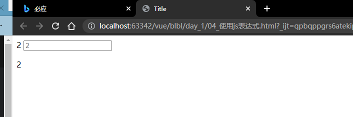

#### vue的指令与过滤器

> 1.指令的概念:
 
指令,是vue为开发者提供的模板语法,用于辅助开发者渲染页面的基本基本结构

vue的指令按照不同的用途可以分为如下六类:

* 内容渲染指令
* 属性绑定指令
* 事件绑定指令
* 双向绑定指令
* 条件渲染指令
* 列表渲染指令

---

> ####1.1内容渲染指令:  

用来辅助开发者渲染DOM元素的文本内容,常用的内容渲染指令有如下三个:

* `v-text`
* `{{}}`
* `v-html`

> `v-text`:

会覆盖元素内部原有的内容

> `{{}}`

插值表达式,在实际开发中用的最多,只是内容的占位符,不会覆盖原有的内容

> `v-html`

可以把带有标签的字符串渲染为html内容

---
* 注意,vue的渲染模板中可以写js的逻辑代码:

```html
<!DOCTYPE html>
<html lang="en">
<head>
    <meta charset="UTF-8">
    <mate name="viewport" content="width=device-width" , initial-scale="1.0"/>
    <title>Title</title>
</head>
<body>
<div id="app">
    {{num + 1}}

    <input type="text" v-bind:placeholder="num+1">

    <p v-html="num+1"></p>
</div>
<script src="lib/vue.js"></script>

<script>
    const vue = new Vue({
        el: '#app',
        data: {
            num: 1
        }
    })
</script>
</body>
</html>
```



还可以使用:
```html
{{num + 1}}
{{ ok ? 'YES' : 'NO'}}
{{message.split('').reverse().join('')}}
<div v-bind:id="'list-' + id"></div>
```

---


