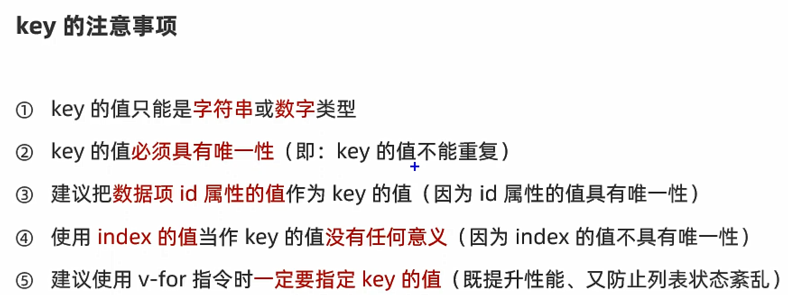

> 列表渲染指令:
vue提供了v-for列表渲染指令,用来辅助开发者基于一个数组来循环渲染一个列表结构.v-for指令需要使用`item in items`形式的特殊语法,其中:

* `item`是待循环的数组
* `item`是被循环的每一项

例如:
`<tr v-for="(item,index) in list">`使用index的  
`<tr v-for="item in list">`不使用index的

```html

<div id="app">
    <table class="table table-bordered table-hover table-striped">
        <thead>
        <th>索引</th>
        <th>ID</th>
        <th>姓名</th>
        </thead>
        <tbody>

        <!--此时是有索引的:-->
        <tr v-for="(item,index) in list">
            <!--此时是没有索引的:-->
            <!--        <tr v-for="item in list">-->
            <td>{{index}}</td>
            <td>{{item.id}}</td>
            <td>{{item.name}}</td>
        </tr>

        </tbody>
    </table>
</div>

<script src="lib/vue.js"></script>
<script src="lib/axios.js"></script>
<script src="https://cdn.jsdelivr.net/npm/jquery@3.5.1/dist/jquery.slim.min.js"
        integrity="sha384-DfXdz2htPH0lsSSs5nCTpuj/zy4C+OGpamoFVy38MVBnE+IbbVYUew+OrCXaRkfj"
        crossorigin="anonymous"></script>
<script src="lib/bootstrap.js"></script>
<script>
    const vm = new Vue({
        el: '#app',
        data: {
            list: [
                {id: 1, name: '张三'},
                {id: 2, name: '李四'},
                {id: 3, name: '王五'},
            ]

        },
        methods: {}, created: {}
    })
</script>
```

* 注意:官方建议,使用了`v-for`指令,一定要绑定一个`:key`属性,并且属性值最好为`item.id`

官方对`key`的值是有类型上的要求,只能为:字符串或数字  
`key`的值是一定不可以重复的,否则会报错


```html
        <!--官方建议,使用时最好绑定一个:key-->
<!--并且,尽量把id作为key的值-->
<tr v-for="(item,index) in list" :key="item.id">
    <td>{{index}}</td>
    <td>{{item.id}}</td>
    <td>{{item.name}}</td>
</tr>
```


