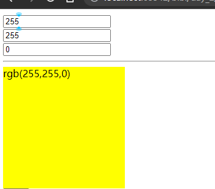

* 什么是计算属性:

> 计算属性指的是通过一系列运算之后,最终得到一个属性值  
> 这个动态计算出来的属性值可以被模板结构或methods方法使用,示例代码如下:

例如:

```html

<div id="app">
    <input type="text" v-model.number="r"><br>
    <input type="text" v-model.number="g"><br>
    <input type="text" v-model.number="b"><br>
    <hr>
    <!--专门用户呈现颜色的div盒子-->
    <!--在属性身上,代表 v-bind属性绑定-->
    <!--:style代表动态绑定一个样式对象,它的值是一个{}样式对象-->
    <div class="block" :style="{backgroundColor : `rgb(${r},${g},${b})`}">
        {{`rgb(${r},${g},${b})`}}
    </div>
</div>
<script src="lib/vue.js"></script>
<script>
    const vm = new Vue({
        el: "#app",
        data: {
            r: 255,
            g: 255,
            b: 0
        },
        computed: {
            rgb() {
                return `rgb(${this.r},${this.g},${this.b})`;
            }
        },
        methods: {
            show() {
                console.log(this.rgb);
            }
        }
    })
</script>
```

输入不同的值,div颜色随之改变  
run:  


> 计算属性的语法:

* 定义在`computed`中:
```html
        //所有的计算属性,都要定义到computed节点
        computed:{

        }
```
* 计算属性在定义的时候,要定义成方法格式  
如:
```html
        computed: {
            rgb() {
                return `rgb(${this.r},${this.g},${this.b})`;
            }
        }
```

> 特点:

* 在定义时要定义成方法格式
* 在使用计算属性的时候,当普通的属性使用即可

> 好处

* 实现了代码的复用
* 只要计算属性中依赖的数据源变化了,则计算属性会自动重新求值


