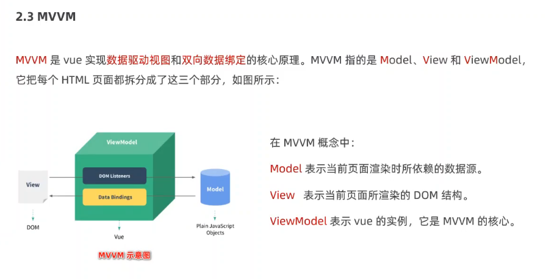

>
>前端主要是视图层的开发,在操作许多dom节点时,可以使用`template`来实现, 而控制它的逻辑需要使用代码,vue可以更方便的对其进行逻辑处理.减少不必要的dom操作,提高渲染率
>

---

### 框架和库的区别

+ 框架:是一套完整的解决方案;对项目的侵入性较大，项目如果需要更换框架，则需要重新架构整个项目

+ 库(插件) :提供某一个小功能，对项目的侵入性较小，如果某个库无法完成某些需求，可以很容易切换到其他库实现需求

---

### Node后端中MVC与前端的MVVM之间的区别

+ MVC 是后端的分层开发概念
+ MVVM是前端视图层的概念,主要关注于视图层分离,也就是说>MVVM把前端的视图层分为了三部分,Model,View,VM ViewModel

