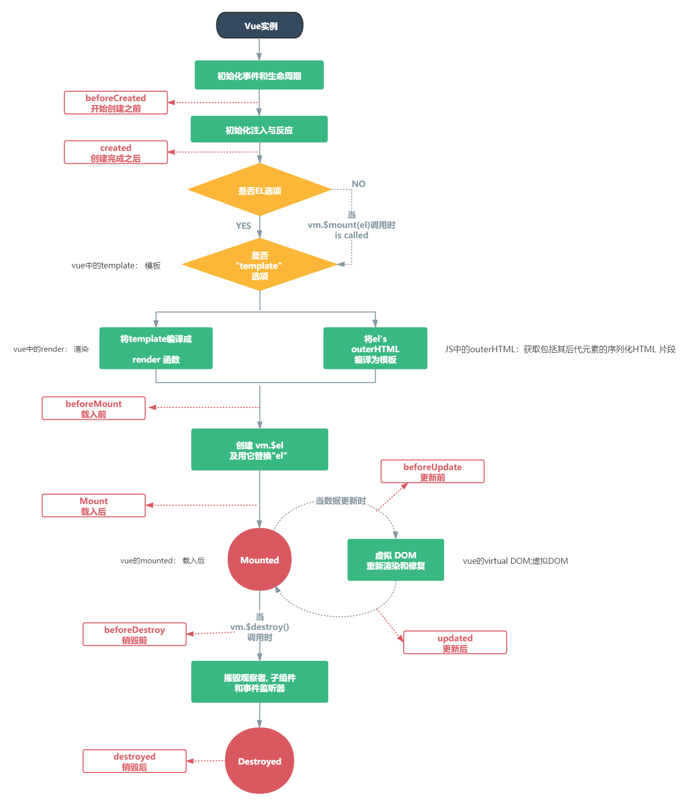

### 组件的生命周期

如图:  


> 1.生命周期和生命周期函数

生命周期是指一个组件从创建->运行->销毁的整个阶段,强调的是一个时间段  
生命周期函数:是由vue框架提供的内置函数,会伴随这组件的生命周期,自动按次序执行

> 组件的生命周期函数分类:

1.组件创建阶段  
* `beforeCreate` -> `created` -> `beforeMount` -> `mounted`

2.组件运行阶段  
* `beforeUpdate` -> `updated`

3.组件销毁阶段  
* `beforeDestroy` -> `destroyed`

> beforeCreate

* 在beforeCreate阶段,组件的propos/data/methods尚未被创建,都处于不可用状态

> created

组件的props/data/methods已创建好,都处于可用的状态,但是组件的模板结构尚未生成  
在此阶段可以使用ajax/axios去获取数据  
注意此时是不能操作DOM的,DOM尚未生成

* 注意此阶段的数据赋值问题:

```js
<script>
export default {
  data: function () {
    return {
      res: {}
    }
  },
  methods: {
    show() {
      console.log('调用了test.vue')
    },
    getBookList() {
      const xhr = new XMLHttpRequest();
      xhr.addEventListener('load',  ()=> {
        this.res = JSON.parse(xhr.responseText);
      });
      xhr.open('GET', 'http://127.0.0.1:81/getpoems?20');
      xhr.send();
    },
  },
  created() {
    console.log(this.info)
    console.log(this.message)
    this.show();
    this.getBookList();
  }
}
</script>
```

在上面的代码中,如果使用下面的代码,其中的this指向会指向function,而此时是无法将返回的数据赋值给vue实例的
```js
      xhr.addEventListener('load',  function() {
        this.res = JSON.parse(xhr.responseText);
      });
```
所以需要使用箭头函数,此时是可以赋值给vm实例的:
```js
      xhr.addEventListener('load',  ()=> {
        this.res = JSON.parse(xhr.responseText);
      });
```

> beforeMount
```html
  beforeMount() {
    //这里面也可以发ajax请求,但是最早发ajax请求的生命周期是created
    //此阶段无法操作DOM,几乎不会被用到
    /*this.show();
    this.getBookList();*/
  },
```

> mounted
```html
    //最早操作DOM的阶段是mounted
    // console.log(this.$el);
```

> beforeUpdate

```html
    //此阶段页面的DOM还没有重新渲染完
    /*console.log('beforeUpdate');
    console.log(this.message);
    const dom =document.querySelector('.text');
    console.log(dom.innerHTML);*/
```

> updated
```html
    //此时数据和UI结构已经完成同步
    //当数据变化之后,为了能够操作最新的DOM结构,必须把代码写到updated生命周期函数
    console.log('beforeUpdate');
    console.log(this.message);
    const dom =document.querySelector('.text');
    console.log(dom.innerHTML);
```

> beforeDestroy

```html
将要销毁此组件,此时尚未销毁,组件还处于正常工作状态
```

> destroy
```html
组件已经被销毁,此组件在浏览器中对应的DOM结构已经被完全移除
```

---

### 组件之间的数据共享

> 组件之间的关系:

* 父子关系
* 兄弟关系

> 父子组件间的数据共享

* 父向子组件共享数据

父组件向子组件共享数据需要使用自定义属性,示例代码如下:

父组件:
```html
<template>
  <div class="father">
    <son :msg="ms" :user="userinfo"></son>
    <hr>
  <p>error:</p>
    <Error></Error>
  </div>
</template>
<script>
import son from '../components/son';
import Error from '../components/error'
export default {
  name: 'Father',
  data() {
    return {
      ms: 'msg信息',
      userinfo: {
        name: 'zs',
        age: 20
      },
    }
  },
  components: {
    son,
    Error
  },
}
</script>
```

子组件:  
要注意,不推荐直接修改`props`中的数据,而是将其传递的参数赋值给另一个对象
```html
<template>
<div class="son">
  {{sonMsg}}
  <p>父组件传过来的 msg 值是:{{sonMsg}}</p>
  <p>父组件传过来的 user 值是:{{sonUser}}</p>
  <hr>
  <p>修改数据:</p>
</div>
</template>
<script>
export default {
  name: "son",
  data:function () {
    return{
      sonMsg:'',
      sonUser:{}
    }
  },
  props:['msg','user']
}
</script>
```

> 子组件向父组件传值:

* 子组件向父组件共享数据使用自定义事件:

父组件引用:  
`Grandpa`为子组件  
要注意这里的`<Grandpa @numChange="getNum"></Grandpa>`其中`numChange`需要在子组件中传入,  
`getNum`为父组件的方法

```html
<template>
    <div class="father">
        <div class="transverse">
            <Grandpa @numChange="getNum"></Grandpa>
            val的值: {{ val }}
        </div>
    </div>
</template>
<script>
    import Grandpa from '../components/grandpa';
    export default {
        name: 'Father',
        data() {
            return {
                val: 1,
            }
        },
        components: {
            Grandpa
        },
        methods: {
            getNum(valNum) {
                this.val = valNum;
            }
        }
    }
</script>
```
子组件:  
要注意这里`this.$emit('numChange',this.count);`,向父组件传值,第一个参数是父组件中引用该子组件并@的function,  
第二个参数是要传入的数据  
`$emit`的意义是触发,只要`add`触发,那么`this.$emit('numChange',this.count);`也会被触发  
```html
<template>
  <div class="grandpa">
    {{ count }}
    <el-button type="danger" plain @click="add">count++</el-button>
  </div>
</template>
<script>
export default {
  name: "grandpa",
  data: function () {
    return {
      count: 0
    }
  },
  methods: {
    add() {
      this.count++;
      this.$emit('numChange',this.count);
    }
  }
}
</script>
```

> 兄弟组件之间的数据共享

* 在vue2.0中,兄弟组件之间的数据共享的方案是EventBus  

* EventsBus使用步骤:

1.创建`eventsBus.js`模块,并向外共享一个vue的实例对象  
2.在数据发送方,调用`bus.$emit('事件名称',要发送的数据)`方法触发自定义事件  
3.在数据接收方,调用bus.$on('事件名称',事件处理函数)方法注册一个自定义事件  

兄弟组件A(数据发送方):
```html
<template>
    <div class="left">
        <el-col :span="8">
            <el-card shadow="always"> left</el-card>
            <el-button @click="send">发送数据</el-button>
            <p>
                str:{{ str }}
            </p>
        </el-col>
    </div>
</template>

<script>
    import bus from '../components/EventBus'
    export default {
        name: "left",
        data: function () {
            return {
                str: '黑云压城城欲摧;驻青沙白鸟飞回',
            }
        },
        methods: {
            send() {
                //通过EventBus来发送数据
                bus.$emit('share', this.str);
            }
        }
    }
</script>
```

EventsBus.js:
```js
import vue from 'vue';
export default new vue(
)
```

数据接收方:
```html
<template>
  <div class="right">
    <el-col :span="8">
      <el-card shadow="always"> right</el-card>
    </el-col>
    <p>
      msg数据:{{ msg }}
    </p>
  </div>
</template>
<script>
import bus from '../components/EventBus'
export default {
  name: "Right",
  data: function () {
    return {
      msg: ''
    }
  },
  created() {
    bus.$on('share', val => {
      this.msg = val;
    })
  }
}
</script>
```


### ref引用

> ref用来辅助开发者在不依赖jquery的情况下,获取DOM元素或组件的引用

> 每个vue组件的实例上,都包含一个`$ref`对象,里面存储着对应的DOM元素或组件的引用.默认情况下,组件的$ref指向一个空对象  

如:  
按钮点击,通过ref获取dom,并修改dom的color属性  
```html
<template>
  <div id="app">
    <h1>app根组件</h1>
    <el-button type="success" @click="showThis">打印this</el-button>
    <h1 ref="myh1">测试文字</h1>
    <h1 ref="myh2">测试文字2</h1>
  </div>
</template>

<script>
export default {
  name: 'App',
  methods: {
    showThis() {
      //当前app组件的实例对象
      console.log(this.$refs.myh1);
      this.$refs.myh2.style.color='red';
    }
  },
  created() {
    // this.showThis();
  }
}
</script>
```

注意,这里要先为一个元素定义`ref`属性:`<h1 ref="myh2">测试文字2</h1>`  
vue的实例会挂在refs,要获取ref的话,需要:`this.$refs.myh1`,即可  

#### 使用ref引用组件实例:

子组件:
```html
<template>
  <div class="left">
    <el-divider content-position="right">left 组件</el-divider>
    <h1>这里是left中的h1</h1>
    <el-button type="primary" @click="addCount">count++</el-button>
    <el-button type="primary" @click="resetCount">count重置</el-button>
    <p>count:{{ count }}</p>
  </div>
</template>

<script>
export default {
  name: "Left",
  data: function () {
    return {
      count: 0
    }
  },
  methods: {
    addCount() {
      this.count++;
    },
    resetCount() {
      this.count = 0;
    }
  }
}
</script>
```

父组件:
```html
<template>
  <div id="app">
    <h1>app根组件</h1>
    <el-button type="success" @click="showThis">打印this</el-button>
    <h1 ref="myh1">测试文字</h1>
    <h1 ref="myh2">测试文字2</h1>
    <p>父组件按钮中的重置count:</p>
    <el-button type="danger" @click="resetLeftCount">重置left中的count</el-button>
    <Left ref="comLeft"></Left>
  </div>
</template>
<script>
import Left from './components/Left'
export default {
  name: 'App',
  methods: {
    showThis() {
      //当前app组件的实例对象
      console.log(this.$refs);
      this.$refs.myh2.style.color = 'red';
    },
    resetLeftCount() {
      this.$refs.comLeft.count = 0;
    }
  },
  components: {
    Left,
  }
}
</script>
```

在上面的父组件中,引用了子组件:`<Left ref="comLeft"></Left>`,同时为子组件添加了ref,此时子组件实例中的refs也挂载在父组件身上,  
如果想在父组件中修改子组件的adta,那么可以通过`this.refs.comLeft`来赋值  

#### `this.$nextTick(cd)`方法

组件的$nextTick(cd)方法,会把cd回调到下一个DOM更新周期之后执行,通俗的理解是:等组件的DOm更新完成之后,再执行cd回调函数,从而保证cd回调函数可以操作到最新的DOM元素

使用场景:  
在下面的代码中,使用`inputVisible`控制input,button的显隐,button点击,触发`showInput`,并通过ref获取input的dom,使其处于focus状态  
但是:
```js
this.inputVisible = true;
his.$refs.iptRef是现在获取不到的因为上面的inputVisible为true,但是页面中的dom结构并不存在,只是数据是最新的
console.log(this.$refs.iptRef)
如果想染this.$refs.iptRef不报错,那么需要保证这行代码执行时,该元素已经被渲染出来
```
实现代码:  
```html
<template>
  <div id="app">
    <input type="text" v-if="inputVisible" @blur="showButton" ref="iptRef">
    <button v-else @click="showInput">展示输入框</button>
  </div>
</template>
<script>
export default {
  name: 'App',
  data: function () {
    return {
      //控制输入框和按钮的按需切换
      //默认值为false,表示默认展示按钮,隐藏输入框
      inputVisible: false
    }
  },
  methods: {
    showInput() {
      this.inputVisible = true;
      //this.$refs.iptRef是现在获取不到的因为上面的inputVisible为true,但是页面中的dom结构并不存在,只是数据是最新的
      console.log(this.$refs.iptRef)
      //如果想染this.$refs.iptRef不报错,那么需要保证这行代码执行时,该元素已经被渲染出来
      this.$refs.iptRef.focus();
    },
    showButton() {
      this.inputVisible = false;
    }
  },
  components: {
    Left,
  }
}
</script>
```

解决:  
如果想染this.$refs.iptRef不报错,那么需要保证这行代码执行时,该元素已经被渲染出来
```js
this.$nextTick(()=>{
        this.$refs.iptRef.focus();
      })
```

