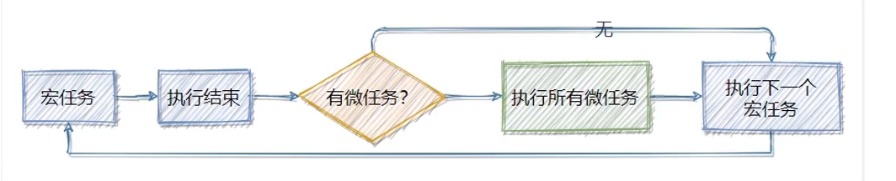

> EventLoop的基本概念:

javascript主线程从任务队列中读取异步任务的回调函数,放到执行栈中一次执行,这个过程是循环不断的,所以整个的这种运行机制又称为EventLoop(事件循环)

> 结合EventLoop分析输出的顺序:

```js
import thenfs from 'then-fs'

console.log('A')

thenfs.readFile('./text/1.txt', 'utf8', function (err, doc) {
	console.log('B')
})

setTimeout(() =>{
	console.log('C')
}, 0)
console.log('D')
//输出ADCB
```

A,D不属于异步耗时任务,所以先输出;B,C委托给了宿主环境,但是C中定时为0,所以相当于没有定时,直接执行

> 宏任务和微任务:

javascript又把异步任务做了进一步的划分:异步任务又分为两类,分别是:

* 1.宏任务,
  * 异步ajax请求
  * setTimeout,setInterval
  * 文件操作
  * 其他宏任务
* 2.微任务
  * Promise.then,.catch和.finally
  * process.nextTick
  * 其他微任务

* 宏任务和微任务的执行顺序:



每一个宏任务执行完之后,都会检查是否存在待执行的微任务,如果有,则执行完所有的微任务之后,再继续执行下一个宏任务


