#### [Vue的基本结构:](#BasicStructure)

#### [Vue中的插值:](#Interpolation)

#### [Vue中的事件修饰符:](#EventModifier)

#### [Vue双向绑定机制:](#TwoWayBinding)

#### [Vue中为元素添加样式:](#AddStyle)

#### [Vue中的动画:](#Animation)

#### [Vue中的循环:](#Loop)

#### [Vue中的key的作用及其意义:](#Key)

#### [Vue中v-fi和v-show:](#IfShow)

#### [Vue中的过滤器:](#SelfFilter)

#### [Vue中的键盘修饰符:](#KeyboardModifier)

#### [Vue中的指令:](#Directive)

#### [Vue中的生命周期:](#LifeLine)

#### [Vue使用vue-resource发送请求:](#SendRequest)

#### [Vue中的组件:](#Component)
---

<a id="BasicStructure"></a>

##### Vue的基本结构:

```html
<!DOCTYPE html>
<html lang="en">
<head>
    <meta charset="UTF-8">
    <mate name="viewport" content="width=device-width" , initial-scale="1.0"/>
    <title>01_vue的基本代码</title>
    <script src="../lib/vue.js"></script>
</head>
<body>
<div id="app">
    <p>
        {{msg}}
    </p>
</div>
<script>
    //创建vue的实例
    //当我们导入包之后,在浏览器的内存中就多了一个vue的构造函数
    //注意,我们新建的对象就是vm,vm为vue的调度者
    var vm = new Vue({
        //el表示当前我们新建的实例要控制页面上的哪个区域
        //id
        el: '#app',
        //data中存放的是el要用到的数据
        //这里的data就是mvvm中的m.专门用老保存页面的数据的
        data: {
            msg: "欢迎学习vue",
            //通过vue提供的指令,很方便的就能把数据渲染到页面上,程序员不再手动操作dom元素了[前端的vue之类的框架,不提倡我们手动操作dom元素]
        },
        //vue中的自定义function
        methods: {},
        //自定义过滤器
        filters: {},
        //自定义私有指令
        directives: {},
        //路由规则
        router: {},
        //定义vue的组件
        components: {},
        //侦听器
        watch: {},
    });
</script>
</body>
</html>
```

---

<a id="Interpolation"></a>

##### Vue中的插值

```html
<!DOCTYPE html>
<html lang="en">
<head>
    <meta charset="UTF-8">
    <mate name="viewport" content="width=device-width" , initial-scale="1.0"/>
    <title>01_vue的基本代码</title>
    <script src="../lib/vue.js"></script>
</head>
<body>
<div id="app">
    <p>
        <!--使用 {{}} 插值:-->
        {{msg}}
    </p>

    <!--使用v-html:-->
    <!--此时会替代div中的内容,但是并不会渲染其中的html标签(对标签转义了)-->
    <div v-text="msg2">123456</div>

    <!--使用v-text进行替换:-->
    <!--此时会替代div中的内容,但是并不会渲染其中的html标签(对标签转义了)-->
    <div v-html="msg2">123456</div>

    <!--使用v-bind进行绑定:-->
    <!--v-bind可以简写为 : -->
    <input type="button" value="简写按钮" v-bind:title="divHtml+'简写'">
    <input type="button" value="简写按钮" :title="divHtml+'简写'">
</div>
<script>
    var vm = new Vue({
        el: '#app',
        //data中存放的是el要用到的数据
        //这里的data就是mvvm中的m.专门用来保存页面的数据的
        data: {
            msg: "欢迎学习vue",
            msg2: "<h1>这是一个h1</h1>",
            divHtml: '<h1>这里是使用v-bind绑定的数据</h1>'
        }
    });
</script>
</body>
</html>
```

---

<a id="EventModifier"></a>

##### Vue事件修饰符

```html
<!DOCTYPE html>
<html lang="en">
<head>
    <meta charset="UTF-8">
    <mate name="viewport" content="width=device-width" , initial-scale="1.0"/>
    <title>事件修饰符</title>
    <script src="../lib/vue.js"></script>
    <style>
        .inner {
            height: 150px;
            background-color: pink;
        }
    </style>
</head>
<body>
<div id="app">
    .stop阻止冒泡
    <!--.stop阻止冒泡-->
    <div class="inner" @click="divHandler">
        <!--
        @click.stop:
        阻止冒泡发生,子元素点击执行function,而父元素不执行
        -->
        <input type="button" value="戳他" @click.stop="btnHandler">
        <!--以下代码不会阻止冒泡行为-->
        <input type="button" value="不阻止默认事件的戳他" @click="btnHandler">
    </div>

    <!--.prevent阻止默认行为-->
    <a href="https://cn.bing.com/" @click.prevent="linkClick">问必应(添加了prevent,阻止默认的跳转事件)</a>
    <hr>
    下面这个(没有添加prevent)就不会阻止跳转到必应
    <hr>
    <a href="https://cn.bing.com/" @click="linkClick">问必应</a>
    <hr>

    <!--
    .capture事件捕获机制
    子元素被点击,父元素也会被点击,但是使用.capture会使父元素先于子元素被执行
    -->
    .capture事件捕获机制
    <div class="inner" @click.capture="divHandler">
        <input type="button" value="戳他" @click="btnHandler">
    </div>
    <hr>

    .self只当事件在该元素本身(比如不是子元素)触发时触发回调
    <!--.self只当事件在该元素本身(比如不是子元素)触发时触发回调-->
    <!--
    实现只有点击自身的时候才会触发点击事件
    -->
    <div class="inner" @click.self="divHandler">
        <input type="button" value="戳他" @click="btnHandler">
    </div>

    <!--.once只触发一次,事件修饰符可以链式编程-->
    <!--只会阻止一次prevent-->
    <a href="https://cn.bing.com/" @click.prevent.once="linkClick">问必应(这个只会阻止一次点击跳转的事件)</a>

    <!--.self和.stop的区别
    .self只会阻止自己身上的冒泡行为,并不会真正阻止默哀跑行为,而.stop则可以
    -->
</div>

<script>
    var vue = new Vue({
        el: "#app",
        data: {}, methods: {
            divHandler() {
                /*冒泡机制:
                里面的被外面的包裹,里面的被点击.外面的点击也会触发
                */
                console.log("这是触发了大Div(粉红色背景)的点击");
            },
            btnHandler() {
                console.log("这还是触发了btn的点击事件");
            },
            linkClick() {
                console.log("触发了a的点击事件");
            }
        }
    })
</script>
</body>
</html>
```

---

<a id="TwoWayBinding"></a>

##### Vue中的双向绑定:

```html
<!DOCTYPE html>
<html lang="en">
<head>
    <meta charset="UTF-8">
    <mate name="viewport" content="width=device-width" , initial-scale="1.0"/>
    <title>双向事件绑定</title>
    <script src="../lib/vue.js"></script>
</head>
<body>
<div id="app">
    <h4>{{msg}}</h4>
    <!--
    v-bind 只能实现数据的单向绑定,从m自动绑定到v中,无法实现数据的双向绑定
    -->
    <p>使用v-bind绑定:</p>
    <input type="text" v-bind:value="msg" style="width: 100%">
    <!--
    实现数据双向绑定,a同步到b或b同步到a都是可以的
    -->
    <p>使用v-model绑定;</p>
    <input type="text" style="width: 100%" v-model="msg">
    <!--
    注意:v-model只能用于表单元素中,
    input(radio,text,address,email...) select,checkbox,textarea
    -->
</div>
<script>
    var vue = new Vue({
        el: "#app",
        data: {
            msg: "关于我家狗看见我在敲代码,立刻给我写了一个电商项目并,买了鱼竿叫我去钓鱼这件事"
        }, methods: {}
    })
</script>
</body>
</html>
```

运行:  
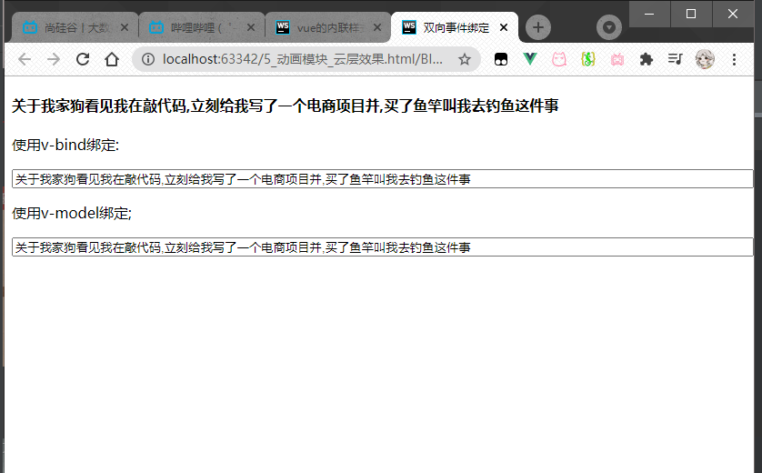  
这里使用`v-bind`绑定的input里面数据改变并不会改变标题的数据,  
而使用`v-model`绑定的数据,改变之后,标题和v-bind的数据都会改变

---

<a id="AddStyle"></a>

##### Vue中为元素添加样式

```html
<!DOCTYPE html>
<html lang="en">
<head>
    <meta charset="UTF-8">

    <mate name="viewport" content="width=device-width" , initial-scale="1.0"/>
    <title>vue的内联样式</title>
    <script src="../lib/vue.js"></script>
</head>
<body>

<div id="app">
    <!--对象就是无序键值对的集合-->
    <p>
        1.直接在元素上通过:style的形式,书写样式对象
    </p>
    <h1 :style="{color:'red','font-weight':200}">这是一个很大的h1</h1>

    <p>
        2.将样式对象,定义到data中去,并直接引用到:style中
    </p>

    <h1 :style="styleobj">这是一个很大的h1</h1>

    <p>
        3.在style中通过数组,引用多个data上的样式对象
    </p>
    <h1 :style="[styleobj,styleobj2]">这是一个很大的h1</h1>
</div>

<script>
    var vue = new Vue({
        el: "#app",
        data: {
            styleobj: {color: 'blue', 'font-weight': 200},
            styleobj2: {
                'font-style': 'italic'
            }
        }, methods: {},
    })
</script>
</body>
</html>
```  

运行:  
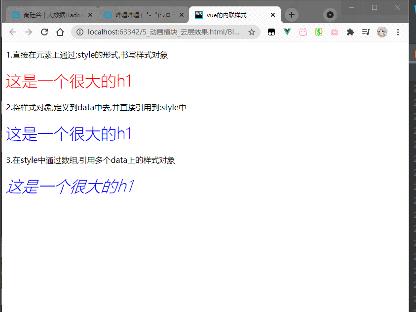

---

<a id="Animation"></a>

##### Vue中的动画:

之前写过,[点这里跳转](https://blog.csdn.net/ice_stone_kai/article/details/114984830?spm=1001.2014.3001.5501)

Vue中动画的修改动画默认前缀:

```html
<!DOCTYPE html>
<html lang="en">
<head>
    <meta charset="UTF-8">
    <mate name="viewport" content="width=device-width" , initial-scale="1.0"/>
    <title>修改动画v-前缀</title>
    <script src="../lib/vue.js"></script>
    <style>
        .v-enter,
        .v-leave-to {
            opacity: 0;
            transform: translateX(80px);
        }

        .v-enter-active,
        .v-leave-active {
            transition: all 0.8s ease;
        }

        /*my-前缀的样式*/
        .my-enter,
        .my-leave-to {
            opacity: 0;
            transform: translateY(80px);
        }

        .my-enter-active,
        .my-leave-active {
            transition: all 0.8s ease;
        }
    </style>
</head>
<body>
<div id="app">
    <input type="button" value="toggle" @click="flag=!flag">
    <!--
    transition中.为他定义属性的前缀默认是v-
    -->
    <transition>
        <h3 v-if="flag">这是一个h3</h3>
    </transition>
    <hr>
    <input type="button" value="toggle2" @click="flag2=!flag2">
    <!--此时如果不想和上面的功用一个style,可以为transition定一个name--->
    <!--
    从而使该transition的样式定义的前缀为my-
    -->
    <transition name="my">
        <h6 v-if="flag2">这是一个h6</h6>
    </transition>
</div>
<script>
    var vm = new Vue({
        el: '#app',
        data: {
            flag: false,
            flag2: false
        },
        methods: {}
    })
</script>
</body>
</html>
```

Vue中使用第三方库实现动画:

```html
<!DOCTYPE html>
<html lang="en">
<head>
    <meta charset="UTF-8">
    <mate name="viewport" content="width=device-width" , initial-scale="1.0"/>
    <title>第三方类实现动画</title>
    <script src="../lib/vue.js"></script>
    <link rel="stylesheet" href="../lib/animate.css">
</head>
<body>
<div id="app">
    <input type="button" value="toggle" @click="flag=!flag">

    <!--下面这个方法需要写两次基本类(animated)-->
    <!--<transition enter-active-class="animated bounceIn"
                leave-active-class="animated bounceOut">
        <h3 v-if="flag">这是一个h3</h3>
    </transition>-->


    <!--基本类写在h3中也可以-->
    <!--
    duration:为该元素指定时间(不明显),指定的是入场和离场的时间(相同的)
    前面带有 : 说明他是属性绑定的
    -->
    <!--
        <transition enter-active-class="bounceIn"
                    leave-active-class="bounceOut" :duration="200">
            <h3 v-if="flag" class="animated">这是一个h3</h3>
        </transition>
    -->

    <!--分别设置进场和离场的时间-->
    <!--
    使用 :duration:"{enter: 200,leave: 400}"来分别设置入场,离场的时长
    -->
    <transition enter-active-class="bounceIn"
                leave-active-class="bounceOut" :duration="{enter:200,leave:800}">
        <h3 v-if="flag" class="animated">这是一个h3</h3>
    </transition>
</div>
<!--入场使用bounceIn 离场使用bounceOut-->
<script>
    var vm = new Vue({
        el: '#app',
        data: {
            flag: false
        },
        methods: {}
    })
</script>
</body>
</html>
```

---

<a id="Loop"></a>

##### Vue中的循环:

```html
<!DOCTYPE html>
<html lang="en">
<head>
    <meta charset="UTF-8">
    <mate name="viewport" content="width=device-width" , initial-scale="1.0"/>
    <title>09_v-for_循环普通数组.html</title>
    <script src="../lib/vue.js"></script>
</head>
<body>
<div id="app">
    <p>
        1.迭代数组
    </p>
    <p v-for="(item,i) in list">value: {{item}} , index: {{i}}</p>
    <hr>
    <p>
        2.迭代对象数组
    </p>
    <p v-for="(user,i) in list2">{{user.id}} + {{user.name}} , 索引: {{i}}</p>
    <hr>
    <p>
        3.循环数字
    </p>
    <p v-for="count in 10">
        这是第 {{count}} 次循环
    </p>
    <hr>
</div>
<script>
    var uve = new Vue({
        el: "#app",
        data: {
            list: [1, 2, 3, 4, 5, 6, 7, 8, 9, 10],
            list2: [
                {id: 1, name: 'zs'},
                {id: 2, name: 'ls'},
                {id: 3, name: 'ww'},
                {id: 4, name: 'xm'},
                {id: 5, name: 'dm'},
            ]
        }, methods: {}
    })
</script>
</body>
</html>
```  

运行:  
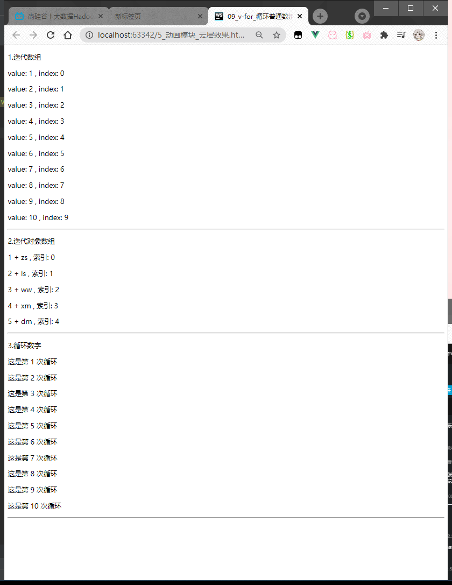

---

<a id="Key"></a>

##### Vue中的key的作用及其意义:

先举个例子:

```html
<!DOCTYPE html>
<html lang="en">
<head>
    <meta charset="UTF-8">
    <mate name="viewport" content="width=device-width" , initial-scale="1.0"/>
    <title>v-for中ley属性的使用</title>
    <script src="../lib/vue.js"></script>
</head>
<body>
<div id="app">
    <div>
        <label>
            Id:
            <input type="text" v-model="id">
        </label>
        <label>
            Name:
            <input type="text" v-model="name">
        </label>
        <input type="button" value="添加" @click="add">
    </div>
    <!--
    注意:v-for循环时,key属性只能用num/sting代替

    注意:key在使用的时候,必须使用b-bing属性绑定的形式,指定key的值

    此时如果没有使用 : 绑定的话,添加对象之前勾选会使添加对象之后的勾选错误
    -->
    <!--
    在组件中,使用v-for循环的时候,或者在一些特殊情况中,如果v-for有问题,必须在使用v-for的同时,指定唯一的字符串/数字类型的 key值
    -->
    <!--        <p v-for="item in list" :key="item.id">-->
    <p v-for="item in list">
        <input type="checkbox"> {{item.id}}---{{item.name}}
    </p>
</div>
<script>
    var vue = new Vue({
        el: "#app",
        data: {
            id: ' ',
            name: ' ',
            list: [
                {id: 1, name: '李斯'},
                {id: 2, name: '嬴政'},
                {id: 3, name: '赵高'},
                {id: 4, name: '韩非'},
                {id: 5, name: '荀子'}
            ]
        },
        methods: {
            add() {
                //添加方法
                // this.list.push({id: this.id, name: this.name});
                this.list.unshift({id: this.id, name: this.name});
            }
        }
    })
</script>
</body>
</html>
```

页面没有任何操作时(没有任何操作时,不管是否使用了key都是一样的):      
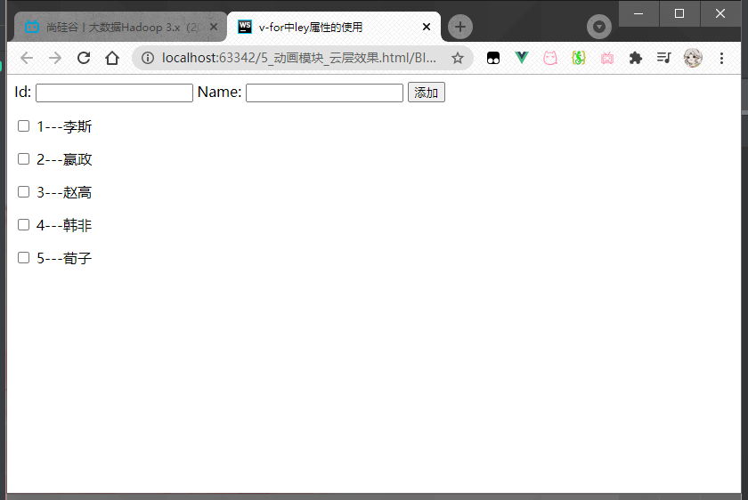  
__*不使用key*__,先勾选前两个之后,之后再添加两个对象时:  
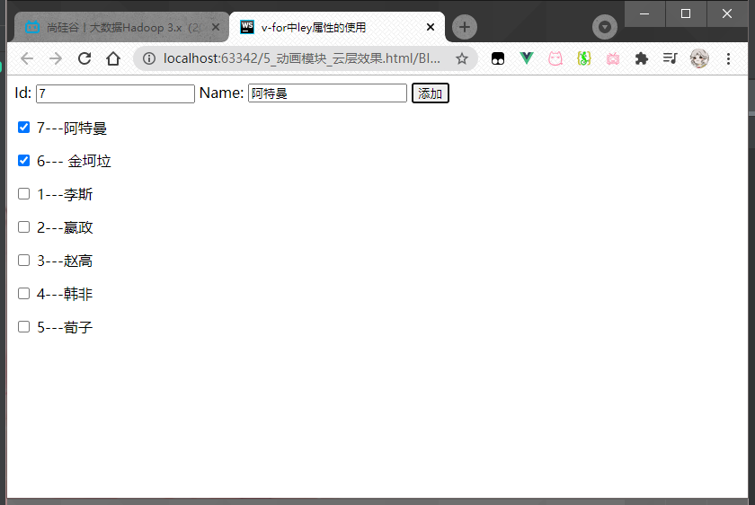  
这时我们发现,勾选的框错误了(正确的应该是勾选在李斯和嬴政上面)

__*使用key*__,先勾选前两个之后,之后再添加两个对象时:  
  
此时是正确的

此时的区别是因为,有了key之后,每个虚拟节点会有一个指定的唯一值(唯一标识符),  
而没有key的话,勾选的节点会复用其他节点的数据
---

<a id="IfShow"></a>

##### Vue中v-fi和v-show:

```html
<!DOCTYPE html>
<html lang="en">
<head>
    <meta charset="UTF-8">
    <mate name="viewport" content="width=device-width" , initial-scale="1.0"/>
    <title>v-if和v-show</title>
    <script src="../lib/vue.js"></script>
</head>
<body>
<div id="app">
    <!--    <input type="button" @click="toggle" value="toggle">-->
    <hr>
    <input type="button" @click="flag=!flag" value="toggle">

    <!--
    v-if的特点是每次都会删除或创建一个元素
    v-show的特点,每次不会进行dom的操作,只是切换了元素的display:none样式

    v-if有较高的切换性能消耗
    v-show有较高的初始渲染消耗

    如果元素涉及到频繁的切换,最好不要用v-if
    如果元素被创建出来后可能永远不被显示,那么就用v-if比较好
    -->
    <h3 v-if="flag">这是用v-if控制的元素</h3>

    <h3 v-show="flag">这是用v-show控制的元素</h3>
</div>
<script>
    var vue = new Vue({
        el: "#app",
        data: {
            flag: true
        }, methods: {
            /*toggle() {
                this.flag = !this.flag;
            }*/
        }
    })
</script>
</body>
</html>
```  

--- 

<a id="SelfFilter"></a>

##### Vue中的过滤器:

定义一个全局过滤器:
顾名思义.定义的全局过滤器是所有的vue元素都可以使用

```html
<!DOCTYPE html>
<html lang="en">
<head>
    <meta charset="UTF-8">
    <mate name="viewport" content="width=device-width" , initial-scale="1.0"/>
    <title>03_过滤器的基本使用</title>
    <script src="../lib/vue.js"></script>
</head>
<body>
<div id="app">
    <p>
        {{msg | msgFormat('疯狂','arg2')}}
    <hr>
    <!--过滤器可以多次调用-->
    {{msg | msgFormat('疯狂','arg2') | test}}
    </p>
</div>
<script>
    /*定义一个全局的过滤器:msgFormat*/
    Vue.filter('msgFormat', function (msg, arg, arg2) {
        // return msg.replace(",", "-")
        //字符串的replace方法,除了可以写一个字符串之外,还可以定义一个正则
        // return msg.replace(/,/g, "-")
        return msg.replace(/,/g, arg + arg2)
    })
    Vue.filter('test', function (msg) {
        return msg + "===========";
    })
    var vue = new Vue({
        el: '#app',
        data: {
            msg: "曾经,我也是世界上最无聊的男人.",
        }, methods: {}
    })
</script>
</body>
</html>
```  

运行:  
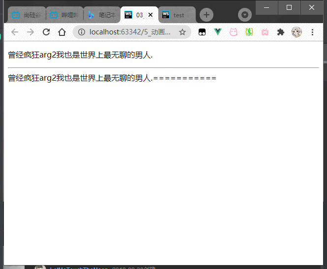

定义私有过滤器:  
是有指定的vue元素可以使用

```html
<!DOCTYPE html>
<html lang="en">
<head>
    <meta charset="UTF-8">
    <mate name="viewport" content="width=device-width" , initial-scale="1.0"/>
    <title>test</title>
    <script src="../lib/vue.js"></script>
</head>
<body>
<div id="app">
    <p>
        {{msg | msgFormat('疯狂','arg2')}}
    <hr>
    <!--过滤器可以多次调用-->
    {{msg | msgFormat('疯狂','arg2') | test}}
    <hr>
    {{msg | SelfFormate('==把逗号更换==','==使用私有过滤器==')}}
    </p>
</div>
<script>
    /*定义一个全局的过滤器:msgFormat*/
    Vue.filter('msgFormat', function (msg, arg, arg2) {
        // return msg.replace(",", "-")
        //字符串的replace方法,除了可以写一个字符串之外,还可以定义一个正则
        // return msg.replace(/,/g, "-")
        return msg.replace(/,/g, arg + arg2)
    })
    Vue.filter('test', function (msg) {
        return msg + "===========";
    })
    var vue = new Vue({
        el: '#app',
        data: {
            msg: "曾经,我也是世界上最无聊的男人.",
        }, methods: {},
        filters: {
            SelfFormate: function (msg, arg, arg2) {
                return msg.replace(/,/g, arg + arg2)
            }
        },
    })
</script>
</body>
</html>
```  

注意"

```javascript
    /*过滤器中的function第一个参数被定死的,永远是过滤器管道符前面传递过来的数据*/
/*    Vue.filter('', function (data) {
    })*/
//自定义私有过滤器(局部)
/*私有过滤器和全局过滤器的名字重复时,若该对象有私有过滤器,则会优先使用私有过滤器.过滤器采用的是就近原则
* * */
```  

运行:  
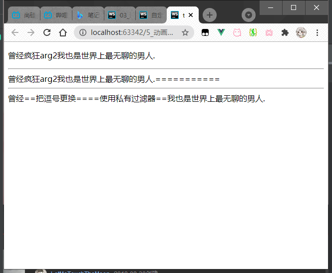

--- 

<a id="KeyboardModifier"></a>

##### Vue中的键盘修饰符:

```html
<!DOCTYPE html>
<html lang="en">
<head>
    <meta charset="UTF-8">

    <mate name="viewport" content="width=device-width" , initial-scale="1.0"/>
    <title>使用回车键回应添加</title>
    <script src="../lib/vue.js"></script>
    <link rel="stylesheet" href="../lib/bootstrap.css">
    <!--vue中不要用到jquery-->
</head>
<body>
<div id="app">
    <div class="panel panel-primary">
        <div class="panel-heading">
            <h3 class="panel-title"> 添加品牌 </h3>
            <div class="panel-body form-inline">
                <label>
                    Id:
                    <input type="text" class="form-control" v-model="Id">
                </label>
                <label>
                    Name:
                    <!--keyup键盘抬起,触发add()操作(添加)-->
                    <!--使用按键修饰符,enter键抬起时执行动作-->
                    <input type="text" class="form-control" v-model="Name" @keyup.enter="add">
                    <!--<input type="text" class="form-control" v-model="Name" @keyup.113="add">-->
                </label>
                <!--V
                这里的@click="add" 也可以写为 @click="add()"
                后者可以传参了
                -->
                <input type="button" value="添加" class="btn btn-primary" @click="add()">
                <label>
                    搜索关键字:
                    <input type="text" class="form-control" v-model="keywords">
                </label>
            </div>
        </div>
    </div>

    <table class="table table-bordered table-hover table-striped">
        <thead>
        <tr>
            <th>Id</th>
            <th>Name</th>
            <th>Ctime</th>
            <th>Operation</th>
        </tr>
        </thead>
        <tbody>
        <!--之前v-for中的数据都是直接从data上的list中直接渲染过来的
        现在我们定义一个search方法,同时,把所有的关键字通过传参的形式,传递给了search方法

         在search方法内部通过for循环,吧所有符合关键字的保存在一个新数组中返回
        -->
        <tr v-for="item in search(keywords)" :key="item.Id">
            <td>{{item.Id}}</td>
            <!--v-text中使用插值表达式会报错-->
            <td v-text="item.Name"></td>
            <!--            <td>{{item.Ctime | dateFormat('yyyy-MM-DD-hh')}}</td>-->
            <td>{{item.Ctime | dateFormat()}}</td>
            <td>
                <!--阻止默认行为-->
                <a href="" @click.prevent="del(item.Id)">删除</a>
            </td>
        </tr>
        </tbody>
    </table>
</div>
<div id="app2">
    {{1 + 1}}
    <h3>
        {{dt | dateFormat()}}
    </h3>
</div>
<script>
    <!--    全局过滤器进行时间格式化-->
    /*全局过滤器是所有的vue实例中都可以使用的*/
    Vue.filter('dateFormat', function (dateStr, pattern = "") {
        //根据给定的时间字符串,得到特定的时间
        var dt = new Date(dateStr)
        var y = dt.getFullYear();
        var m = dt.getMonth() + 1;
        var d = dt.getDate();
        if (pattern && pattern.toLowerCase() === 'yyyy-mm-dd') {
            //如果在使用时没有传入格式,那么就是用下面这个字符串片段
            return `${y}-${m}-${d}`;
        } else {
            var hh = dt.getHours();
            var mm = dt.getMinutes();
            var ss = dt.getSeconds();
            return `${y}-${m}-${d} ${hh}:${mm}:${ss} 你没有传入格式字符串`;
        }
    })
    var vue = new Vue({
        el: "#app",
        data: {
            Id: '',
            Name: '',
            keywords: '',
            list: [
                {Id: 1, Name: '奔驰', Ctime: new Date()},
                {Id: 2, Name: '宝马', Ctime: new Date()},
            ]

        },
        methods: {
            add() {
                // console.log("ok");
                var car = {Id: this.Id, Name: this.Name, Ctime: new Date(),}
                this.list.push(car);
                this.Id = this.Name = "";
            },
            del(Id) {
                //some总如果返回了true,就会立即终止数组的循环
                /*this.list.some((item, i) => {
                    if (item.Id == Id) {
                        this.list.splice(i, 1);
                        return true;
                    }
                })*/

                //使用find:专门查找索引
                var index = this.list.findIndex(item => {
                    if (item.Id = Id) {
                        return true;
                    }
                })
                // console.log(index);
                this.list.splice(index, 1);
            },
            search(keywords) {
                //根据关键字进行数据的搜索
                /*var newlist = [];
                this.list.forEach(item => {
                    if (item.Name.indexOf(keywords) != -1) {
                        newlist.push(item);
                    }
                })
                return newlist;*/

                //注意,foreach some filter findIndex都属于数组的新方法,都会对数组中的每一项进行遍历,执行相关操作

                //注意,在es6中提供了一个新方法, String.prototype.includes('要包含的字符串')
                //如果包含,则返回true,如果不包含,则返回false
                return this.list.filter(item => {
                    if (item.Name.includes(keywords)) {
                        return item;
                    }

                })
            },
        }
    })

    // Vue.filter('过滤器名称', function () {
    //
    // })

    /*过滤器中的function第一个参数被定死的,永远是过滤器管道符前面传递过来的数据*/
    /*    Vue.filter('', function (data) {
        })*/

    //自定义私有过滤器(局部)
    /*私有过滤器和全局过滤器的名字重复时,若该对象有私有过滤器,则会优先使用私有过滤器.过滤器采用的是就近原则
    * * */
    var vm2 = new Vue({
        el: '#app2',
        data: {
            dt: new Date(),

        }, methods: {},
        //这里面定义私有过滤器
        filters: {
            //    过滤器有两个条件: [过滤器名称 和 处理函数]
            dateFormat: function (dateStr, pattern = "") {
                //根据给定的时间字符串,得到特定的时间
                var dt = new Date(dateStr)
                var y = dt.getFullYear();
                // var m = dt.getMonth();
                /*
                将String用str补全至maxLength位(顺序补全)
                String.padStart(maxLength,str)

                将String用str补全至maxLength位(倒序补全)
                String.padEnd(maxLength,str)

                * */
                var m = (dt.getMonth() + 1).toString().padStart(2, '0');
                var d = (dt.getDate() + 1).toString().padStart(2, '0');
                if (pattern && pattern.toLowerCase() === 'yyyy-mm-dd') {
                    //如果在使用时没有传入格式,那么就是用下面这个字符串片段
                    return `${y}-${m}-${d}`;
                } else {
                    var hh = (dt.getHours() + 1).toString().padStart(2, '0');
                    var mm = (dt.getMinutes() + 1).toString().padStart(2, '0');
                    var ss = (dt.getSeconds() + 1).toString().padStart(2, '0');
                    return `${y}-${m}-${d} ${hh}:${mm}:${ss} 自定义过滤器`;
                }
            }

        }
    })
</script>
</body>
</html>
```

如图,在name框中按下enter立刻提添加对象  
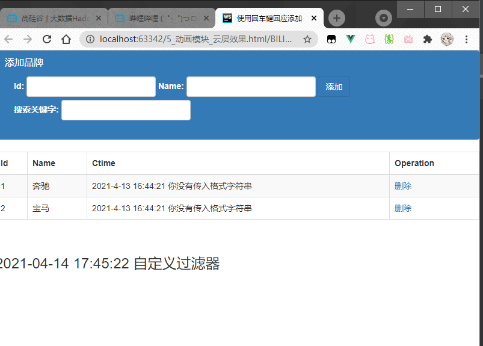

使用自定义的按键修饰符:

```html
<!DOCTYPE html>
<html lang="en">
<head>
    <meta charset="UTF-8">
    <mate name="viewport" content="width=device-width" , initial-scale="1.0"/>
    <title>自定义私有指令</title>
    <script src="../lib/vue.js"></script>
    <link rel="stylesheet" href="../lib/bootstrap.css">
    <!--vue中不要用到jquery-->
</head>
<body>
<div id="app">
    <div class="panel panel-primary">
        <div class="panel-heading">
            <h3 class="panel-title"> 添加品牌 </h3>
            <div class="panel-body form-inline">
                <label>
                    Id:
                    <input type="text" class="form-control" v-model="Id">
                </label>
                <label>
                    Name:
                    <!--keyup键盘抬起,触发add()操作(添加)-->
                    <!--使用按键修饰符,enter键抬起时执行动作-->
                    <!--<input type="text" class="form-control" v-model="Name" @keyup.enter="add">-->
                    (使用指定的的按键修饰符,按下f2执行添加)
                    <input type="text" class="form-control" v-model="Name" @keyup.113="add">
                </label>
                <!--V
                这里的@click="add" 也可以写为 @click="add()"
                后者可以传参了
                -->
                <input type="button" value="添加" class="btn btn-primary" @click="add()">
                <label>
                    搜索关键字:
                    <!--                    <input type="text" class="form-control" v-model="keywords" id="search">-->
                    <!--vue中所有的指令在调用时都以v-开头-->
                    <!--                    <input type="text" class="form-control" v-model="keywords" id="search" v-focus v-color>-->
                    <!--自定义颜色:-->
                    <!--如果这里""内不使用''单引号括起来的话,等于的就是一个变量,而不是字符串了-->
                    <input type="text" class="form-control" v-model="keywords" id="search" v-focus v-color="'blue'">
                </label>
            </div>
        </div>
    </div>

    <table class="table table-bordered table-hover table-striped">
        <thead>
        <tr>
            <th>Id</th>
            <th>Name</th>
            <th>Ctime</th>
            <th>Operation</th>
        </tr>
        </thead>
        <tbody>
        <!--之前v-for中的数据都是直接从data上的list中直接渲染过来的
        现在我们定义一个search方法,同时,把所有的关键字通过传参的形式,传递给了search方法
         在search方法内部通过for循环,吧所有符合关键字的保存在一个新数组中返回
        -->
        <tr v-for="item in search(keywords)" :key="item.Id">
            <td>{{item.Id}}</td>
            <!--v-text中使用插值表达式会报错-->
            <td v-text="item.Name"></td>
            <!--            <td>{{item.Ctime | dateFormat('yyyy-MM-DD-hh')}}</td>-->
            <td>{{item.Ctime | dateFormat()}}</td>
            <td>
                <!--阻止默认行为-->
                <a href="" @click.prevent="del(item.Id)">删除</a>
            </td>
        </tr>
        </tbody>
    </table>
</div>

<div id="app2">
    {{1 + 1}}
    <h3 v-color="'pink'">
        {{dt | dateFormat()}}
    </h3>
</div>


<script>
    /*全局自定义键盘修饰符*/
    Vue.config.keyCodes.f2 = 113;

    <!--    全局过滤器进行时间格式化-->
    /*全局过滤器是所有的vue实例中都可以使用的*/
    Vue.filter('dateFormat', function (dateStr, pattern = "") {
        //根据给定的时间字符串,得到特定的时间
        var dt = new Date(dateStr)
        var y = dt.getFullYear();
        var m = dt.getMonth() + 1;
        var d = dt.getDate();
        if (pattern && pattern.toLowerCase() === 'yyyy-mm-dd') {
            //如果在使用时没有传入格式,那么就是用下面这个字符串片段
            return `${y}-${m}-${d}`;
        } else {
            var hh = dt.getHours();
            var mm = dt.getMinutes();
            var ss = dt.getSeconds();
            return `${y}-${m}-${d} ${hh}:${mm}:${ss} 你没有传入格式字符串`;
        }
    })

    /*设置全局的自定义命令:
    使用Vue.directive()定义全局的指令 v-focus
    其中参数一: 指令的名称,注意在定义的时候,指令的名称前面,不需要加v-前缀
    但是在调用的时候,必须在指令前面加上 v- 前缀来进行调用
    参数二: 是一个对象,这个对象身上,有一些指令相关的函数,这些函数可以在特定的阶段,执行相关的操作
    * * */
    Vue.directive('focus', {
        bind: function (el) {//每当指令绑定到元素上的时候,会立即执行这个bind函数 只执行一次
            //注意:在每一个函数中,第一个参数永远是el,表示被指令的那个元素,这个el参数是一个原生的js对象(就是dom对象)
            //在元素刚绑定了指令的时候,还没有插入到dom中去,这时候,调用focus方法没有作用
            //因为一个元素只有插入dom之后才能获取焦点
            // el.focus();
        },
        inserted: function (el) {//inserted表示元素插入到dom中的时候会执行inserted函数
            //和js行为有关的操作,最好在inserted中执行,防止js行为不生效
            el.focus();
        },
        updated: function () {//当VNode更新的时候,会执行update,肯能会触发多次[触发一次]

        }
    })

    //自定义一个为字体设置颜色的指令
    //设置样式时,不用关心元素是否被渲染到dom中,而style样式是直接绑定给元素的
    Vue.directive('color', {
        //样式只要通过指令绑定给力元素,不管这个元素有没有被插入到页面中去,这个元素肯定有了一个内联的样式
        //将来元素肯定会显示到页面中去,这时候,浏览器的渲染引擎必然会解析样式.应用给这个元素

        /*binding是形参,用什么来接收都可以,所以binding可以写为其他的*/
        bind: function (el, binding) {
            //和样式相关的操作,一般都可以在bind中执行
            // el.style.color = 'red';
            console.log(binding);
            /*使用传入的颜色*/
            el.style.color = binding.value;
        },
    })

    var vue = new Vue({
        el: "#app",
        data: {
            Id: '',
            Name: '',
            keywords: '',
            list: [
                {Id: 1, Name: '奔驰', Ctime: new Date()},
                {Id: 2, Name: '宝马', Ctime: new Date()},
            ]

        },
        methods: {
            add() {
                // console.log("ok");
                var car = {Id: this.Id, Name: this.Name, Ctime: new Date(),}
                this.list.push(car);
                this.Id = this.Name = "";
            },
            del(Id) {
                //some总如果返回了true,就会立即终止数组的循环
                /*this.list.some((item, i) => {
                    if (item.Id == Id) {
                        this.list.splice(i, 1);
                        return true;
                    }
                })*/

                //使用find:专门查找索引
                var index = this.list.findIndex(item => {
                    if (item.Id = Id) {

                        return true;
                    }
                })
                // console.log(index);
                this.list.splice(index, 1);
            },
            search(keywords) {
                //根据关键字进行数据的搜索
                /*var newlist = [];
                this.list.forEach(item => {
                    if (item.Name.indexOf(keywords) != -1) {
                        newlist.push(item);
                    }
                })
                return newlist;*/

                //注意,foreach some filter findIndex都属于数组的新方法,都会对数组中的每一项进行遍历,执行相关操作

                //注意,在es6中提供了一个新方法, String.prototype.includes('要包含的字符串')
                //如果包含,则返回true,如果不包含,则返回false
                return this.list.filter(item => {
                    if (item.Name.includes(keywords)) {
                        return item;
                    }

                })
            },
        }
    })

    // Vue.filter('过滤器名称', function () {
    //
    // })

    /*过滤器中的function第一个参数被定死的,永远是过滤器管道符前面传递过来的数据*/
    /*    Vue.filter('', function (data) {
        })*/

    //自定义私有过滤器(局部)
    /*私有过滤器和全局过滤器的名字重复时,若该对象有私有过滤器,则会优先使用私有过滤器.过滤器采用的是就近原则
    * * */
    3
    var vm2 = new Vue({
        el: '#app2',
        data: {
            dt: new Date(),

        }, methods: {},
        //这里面定义私有过滤器
        filters: {
            //    过滤器有两个条件: [过滤器名称 和 处理函数]
            dateFormat: function (dateStr, pattern = "") {
                //根据给定的时间字符串,得到特定的时间
                var dt = new Date(dateStr)
                var y = dt.getFullYear();
                // var m = dt.getMonth();
                /*
                将String用str补全至maxLength位(顺序补全)
                String.padStart(maxLength,str)

                将String用str补全至maxLength位(倒序补全)
                String.padEnd(maxLength,str)

                * */
                var m = (dt.getMonth() + 1).toString().padStart(2, '0');
                var d = (dt.getDate() + 1).toString().padStart(2, '0');
                if (pattern && pattern.toLowerCase() === 'yyyy-mm-dd') {
                    //如果在使用时没有传入格式,那么就是用下面这个字符串片段
                    return `${y}-${m}-${d}`;
                } else {
                    var hh = (dt.getHours() + 1).toString().padStart(2, '0');
                    var mm = (dt.getMinutes() + 1).toString().padStart(2, '0');
                    var ss = (dt.getSeconds() + 1).toString().padStart(2, '0');
                    return `${y}-${m}-${d} ${hh}:${mm}:${ss} 自定义过滤器`;
                }
            }
        }
    })
    //设置进入页面时的焦点
    //但是vue不提倡这么做
    document.getElementById('search').focus()
</script>
</body>
</html>
```

---  

<a id="Directive"></a>

##### Vue中的指令:

注意这里的`directive`后面不加 s ,私有指令的后面加 s

自定义全局指令:

```html
<!DOCTYPE html>
<html lang="en">
<head>
    <meta charset="UTF-8">
    <mate name="viewport" content="width=device-width" , initial-scale="1.0"/>
    <title>使用回车键回应添加</title>
    <script src="../lib/vue.js"></script>
    <link rel="stylesheet" href="../lib/bootstrap.css">
    <!--vue中不要用到jquery-->
</head>
<body>
<div id="app">
    <p v-fontweight="'30'">私有指令测试</p>
    <p v-fontweight="'900'">{{msg}}</p>
</div>

<script>
    Vue.directive('fontweight', {
        bind: function (el, binding) {
            el.style.fontWeight = binding.value;
            el.style.color = 'red';
        }
    })
    var vm = new Vue({
        el: '#app',
        data: {
            msg: 'data中用以测试的数据'
        }, methods: {},
        //这里面定义私有过滤器
        filters: {},
    })
</script>
</body>
</html>
```

自定义私有指令:

```html
<!DOCTYPE html>
<html lang="en">
<head>
    <meta charset="UTF-8">
    <mate name="viewport" content="width=device-width" , initial-scale="1.0"/>
    <title>使用回车键回应添加</title>
    <script src="../lib/vue.js"></script>
    <link rel="stylesheet" href="../lib/bootstrap.css">
    <!--vue中不要用到jquery-->
</head>
<body>
<div id="app">
    <p v-fontweight="'30'">私有指令测试</p>
    <p v-fontweight="'900'">{{msg}}</p>
</div>

<script>
    var vm = new Vue({
        el: '#app',
        data: {
            msg: 'data中用以测试的数据'

        }, methods: {},
        //这里面定义私有过滤器
        filters: {},
        directives: {
            'fontweight': {
                bind: function (el, binding) {
                    el.style.fontWeight = binding.value;
                    el.style.color = 'red';
                }
            }
        },
    })
</script>
</body>
</html>
```  

指令简写:

```html
<!DOCTYPE html>
<html lang="en">
<head>
    <meta charset="UTF-8">
    <mate name="viewport" content="width=device-width" , initial-scale="1.0"/>
    <title>指令简写</title>
    <script src="../lib/vue.js"></script>
</head>
<body>
<div id="app">
    <h3 v-fontsize="'20'" v-color="'red'">
        这是一个用于测试字体大小的指令
    </h3>
</div>
<!--
函数简写:
大多数情况下,我们想在bind和update钩子上做重复动作,并且不关心其他的钩子函数,可以这样写:
Vue.directive('color-swatch',function(el,binding){
el.style.backgroundColor=binding.value;
})
-->
<script>
    var vm = new Vue({
        el: '#app',
        data: {}, methods: {}, filters: {}, directives: {
            //注意,这个function等同于把代码写到了bind和update中去
            'fontsize': function (el, binding) {
                // el.style.fontSize = binding.value;
                el.style.fontSize = parseInt(binding.value) + 'px';
            }, 'color': function (el, binding) {
                el.style.color = binding.value;
            }
        }
    })
</script>
</body>
</html>
```  

运行:  
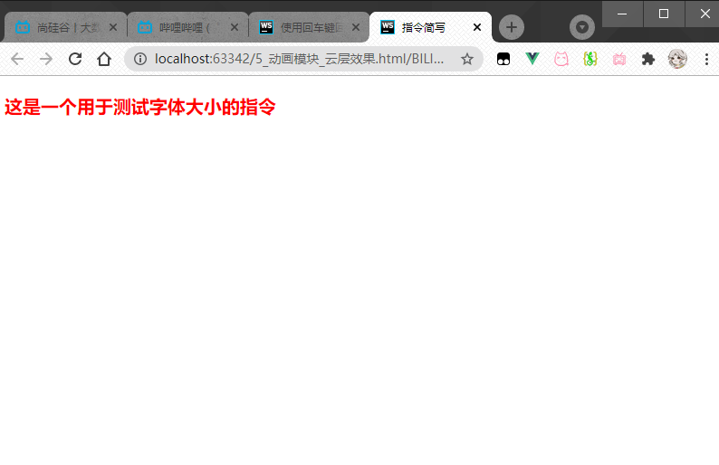

---

<a id="LifeLine"></a>

###### Vue中的生命周期:

```html
<!DOCTYPE html>
<html lang="en">
<head>
    <meta charset="UTF-8">
    <mate name="viewport" content="width=device-width" , initial-scale="1.0"/>
    <title>生命周期</title>
    <script src="../lib/vue.js"></script>
</head>
<body>
<div id="app">
    <input type="button" value="修改" @click="msg='No'">
    <h3 id="h3">{{msg}}</h3>
</div>
<script>
    var vm = new Vue({
        el: '#app',
        data: {
            msg: "ok"
        },
        methods: {
            show() {
                console.log("执行了show方法");
            }
        },
        beforeCreate() {//这是我们遇到的第一个生命周期,表示实例完全被创建出来之前,会执行它
            // console.log(this.msg);
            // this.show()
            // 注意:在beforeCreate生命周期函数执行的时候,data和methods中的数据都还没有被初始化
        },
        created() {//这是遇到的第二个生命周期函数
            // console.log(this.msg);
            // this.show()
            //在created中,data和methods都已经被初始化好了
            //如果要调用methods中的方法,或者操作data中的数据,最早,只能在created中操作
        },
        beforeMount() {//这是遇到的第三个生命周期函数,表示模板已经在内存中编译完成了,但是尚未把模板渲染到页面中去
            console.log('beforeMount    ' + document.getElementById('h3').innerText)
            //beforeMount执行的时候,页面中的元素并没有被替换过来,只是之前写的模板字符串
        },
        mounted() {//遇到的第四个生命周期函数,表示内存中的模板,已经真实地挂载到了页面中去,用户已经可以看到渲染好的页面了
            console.log('mounted    ' + document.getElementById('h3').innerText)
            //注意:mounted是实例创建期间的最后一个生命周期函数,当执行完mounted就表示,实例已经被完全创建好了,此时,如果没有其他操作,这个实例就已经存在与内存当中了
            //此时组件已经脱离了创建阶段,进入了运行阶段
        },
        //组件运行阶段的生命周期函数只有两个:beforeUpdate和updated
        //这两个会根据数据的改变有选择性的触发零次到无数次

        //下面是运行中的两个事件:
        beforeUpdate() {//这时候表示我们的页面还没有被更新
            console.log('beforeUpdate(界面上元素的内容)    ' + document.getElementById('h3').innerText)
            console.log('date中的最新数据是:   ' + this.msg)
            //当执行beforeUpdate时,页面中显示的数据还是旧的,此时date数据是最新的,页面尚未和最新的数据保持同步
        },
        updated() {
            console.log('updated(界面上元素的内容)    ' + document.getElementById('h3').innerText)
            console.log('date中的最新数据是:   ' + this.msg)
            //updated执行的时候,页面上的内容和数据已经保持同步了,都是最新的
        }
    })
</script>
</body>
</html>

```

--- 

<a id="SendRequest"></a>

##### Vue使用vue-resource发送请求:

```html
<!DOCTYPE html>
<html lang="en">
<head>
    <meta charset="UTF-8">
    <mate name="viewport" content="width=device-width" , initial-scale="1.0"/>
    <title>vue-resource</title>
    <script src="../lib/vue.js"></script>
    <!--要在vue后面导入这个包,它依赖于vue
    它在vue身上挂载了 this.$http
    -->
    <script src="../lib/vue-resource1.3.4.js"></script>
</head>
<body>
<div id="app">
    <input type="button" value="发送get请求" @click="getInfo">
    <input type="button" value="发送post请求" @click="postInfo">
    <input type="button" value="发送jsonp请求" @click="jsonpInfo">
</div>

<script>
    var vm = new Vue({
        el: '#app',
        data: {}, methods: {
            getInfo() {
                //发起get请求:
                //http://vue/studyit.io/api/getlunbo
                // this.$http.get('https://api.apiopen.top/searchMusic?name=%E5%A5%BD%E4%B9%85%E4%B8%8D%E8%A7%81').then(function (result) {
                this.$http.get('https://api.imjad.cn/cloudmusic/?type=song&id=28012031&br=128000').then(function (result) {
                    console.log(result.body);
                })
            },
            postInfo() {
                //发起post请求
                //手动发起的post请求没有表单格式,所以,有的服务器处理不了
                //通过post方法的第三个参数,设置提交的内容类型,为普通表单数据格式
                this.$http.post('https://api.imjad.cn/cloudmusic/?type=song&id=28012031&br=128000', {}, {emulateJSON: true}).then(result => {
                    console.log(result.body);
                })
            },
            jsonpInfo() {
                //发起jsonp请求
                this.$http.jsonp('http://vue.studyit.io/qpi/jsonp').then(result => {
                    console.log(result);
                })
            }
        }, filters: {}, directives: {}
    })
</script>
</body>
</html>
```  

---  

<a id="Component"></a>

##### Vue中的组件:

使用全局组件:

```html
<!DOCTYPE html>
<html lang="en">
<head>
    <meta charset="UTF-8">
    <mate name="viewport" content="width=device-width" , initial-scale="1.0"/>
    <title>07_创建组件</title>
    <script src="../lib/vue.js"></script>
</head>
<body>
<div id="app">
    <!--如果要使用组件,直接把组件的名称,以html标签的形式,引入到页面中,即可-->
    <mycom1></mycom1>
</div>

<script>
    //1.1 使用Vue.extend来创建全局的vue组件
    var com1 = Vue.extend({
        template: '<h3>这是使用vue.extend创建的组件</h3>'//通过template属性,指定了组件要展示的html
    });
    //1.2 使用Vue.component('组件名称','创建出来的组件模板对象')
    /*
    使用驼峰命名时,在调用组件的时候必须把大写改为小写,在两个单词之间加 -
    * */
    // Vue.component('myCom1', com1);
    /*
    如果没有用驼峰命名法,那么不用在大写字母前加 -
    * */
    Vue.component('mycom1', com1);
    var vm = new Vue({
        el: '#app',
    });


    //2.也可以这样写:
    //Vue.component第一个参数:组件的名称,将来在引用组件的时候,就是一个标签形式来引入它的
    //第二个参数: VUe.extend 创建组件 ,其中,template就是组件将来要展示的html内容
    //注意:不论是那种方式创建出来的组件,组件的template属性指向的模板内容,必须有且只能有一个根元素
    //而且这种方式写模板字符串是没有提示的
    /*Vue.component('mycom1', Vue.extend({
        template: '<h3>这是使用vue.extend创建的组件</h3>'
    }));
    var vm = new Vue({
        el: '#app',
    })*/

    //3.或者:  
    /*Vue.component('mycom2', {
        template: '<h3>这是使用Vue.component 创建出来的组件</h3>'
    });
    var vm = new Vue({
        el: '#app',
    })*/
</script>
</body>
</html>
```  

运行:  
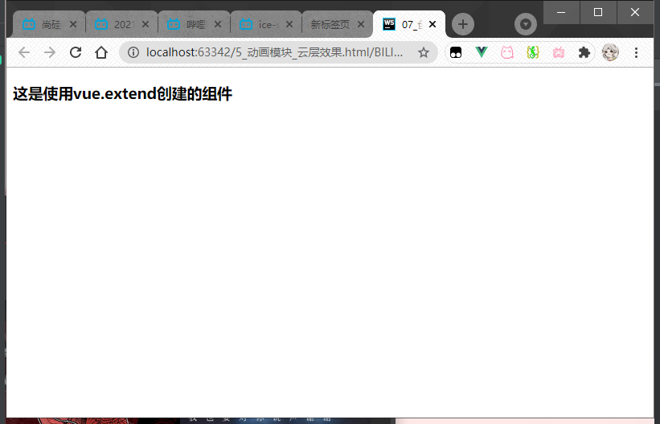

通过template创建组件:

```html
<!DOCTYPE html>
<html lang="en">
<head>
    <meta charset="UTF-8">
    <mate name="viewport" content="width=device-width" , initial-scale="1.0"/>
    <title>组件创建_3</title>
    <script src="../lib/vue.js"></script>
</head>
<body>
<!--在被控制的div外面,使用template元素定义组件的模板结构-->
<template id="tmp1">
    <div>
        <h1>这是通过template在外部定义的组件结构,这个方式有代码的智能提示和高亮</h1>
        <h3>好用且不错</h3>
    </div>
</template>
<div id="app">
    <mycom3></mycom3>
</div>
<script>
    Vue.component('mycom3', {
        template: '#tmp1',
    })
    var vm = new Vue({
        el: '#app'
    })
</script>
</body>
</html>
```  

运行:
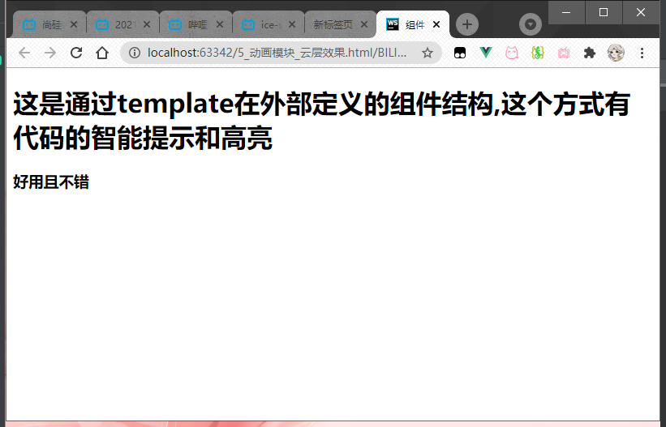

创建私有组件:

```html
<!DOCTYPE html>
<html lang="en">
<head>
    <meta charset="UTF-8">
    <mate name="viewport" content="width=device-width" , initial-scale="1.0"/>
    <title>10_创建私有模板</title>
    <script src="../lib/vue.js"></script>
</head>
<body>
<!--在被控制的div外面,使用template元素定义组件的模板结构-->
<template id="tmp1">
    <div>
        <h1>这是通过template在外部定义的组件结构,这个方式有代码的智能提示和高亮</h1>
        <h3>好用且不错</h3>
    </div>
</template>
<template id="tmp2">
    <h1>这是私有的login组件</h1>
</template>

<div id="app">
    <mycom3></mycom3>
</div>

<div id="app2">
    <login></login>
</div>

<script>
    Vue.component('mycom3', {
        template: '#tmp1',
    })
    var vm = new Vue({
        el: '#app'
    })
</script>

<script>
    vm2 = new Vue({
        el: '#app2',
        data: {},
        methods: {},
        filters: {},
        directives: {},
        components: {//实例内部定义有组件
            login: {
                // template: '<h1>这是私有的login组件</h1>'
                //或者在外部定义template
                template: '#tmp2'
            }
        },
    })
</script>
</body>
</html>
```  

运行:  
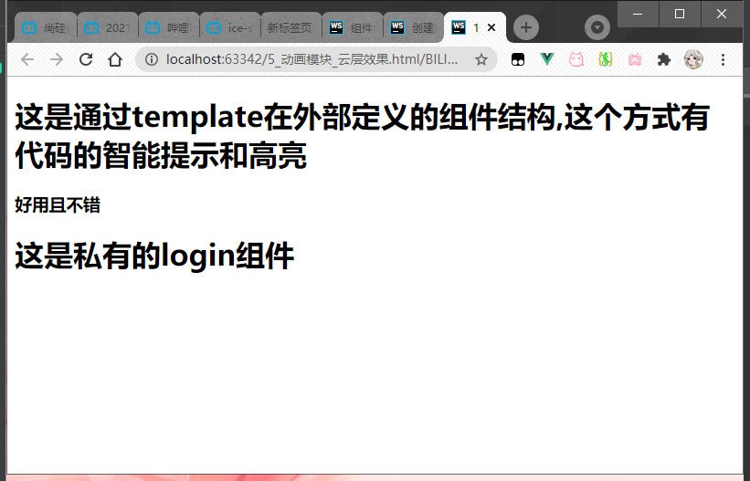

组件中定义数据:

```html
<!DOCTYPE html>
<html lang="en">
<head>
    <meta charset="UTF-8">
    <mate name="viewport" content="width=device-width" , initial-scale="1.0"/>
    <title>组件中的data和methods</title>
    <script src="../lib/vue.js"></script>
</head>
<body>
<div id="app">
    <mycom1></mycom1>
</div>

<script>
    // 1.组件可以有自己的data数据
    //2.组件大data和实例的data有些不一样，实例中的data可以作为一个对象，但是组件中的data必须是一个方法
    //3.组件中的data必须为一个方法之外，这个方内部还必须返回一个对象才行
    Vue.component('mycom1', {
                template: '<h1>这个是全局组件{{msg}}</h1>',
                data: function () {
                    return {
                        msg: '---这是组件中的定义的数据---'
                    }
                }
            }
    )
    var vm = new Vue({
        el: '#app',
        data: {}, methods: {},
    })
</script>
</body>
</html>
```  

运行:  
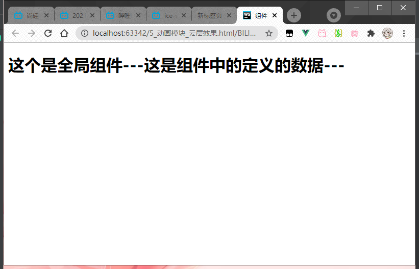

组件的切换(这个只能切换两个组件):

```html
<!DOCTYPE html>
<html lang="en">
<head>
    <meta charset="UTF-8">
    <mate name="viewport" content="width=device-width" , initial-scale="1.0"/>
    <title>13_不同组件之间的切换</title>
    <script src="../lib/vue.js"></script>
</head>
<body>
<!--缺陷:只能切换俩-->
<div id="app">
    <a href="#" @click.prevent="flag=true">登录</a>
    <a href="#" @click.prevent="flag=false">注册</a>
    <login v-if="flag"></login>
    <register v-else="flag"></register>
</div>
<script>
    Vue.component('login', {
        template: '<h3>登录组件</h3>'
    })
    Vue.component('register', {
        template: '<h3>注册组件</h3>'
    })
    var vm = new Vue({
        el: '#app',
        data: {
            flag: false
        },
        methods: {}
    })
</script>
</body>
</html>
```

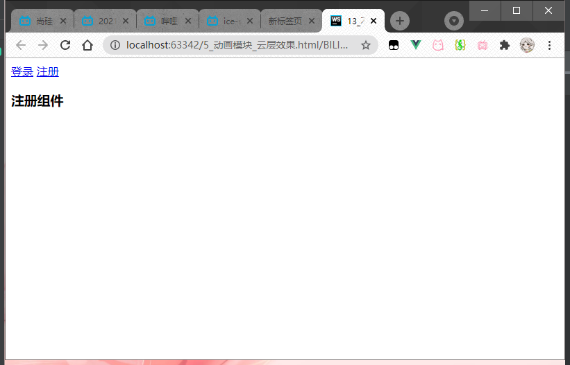

组件切换二(可以切换两个及以上):

```html
<!DOCTYPE html>
<html lang="en">
<head>
    <meta charset="UTF-8">
    <mate name="viewport" content="width=device-width" , initial-scale="1.0"/>
    <title>14_不同组件之间切换_方式二</title>
    <script src="../lib/vue.js"></script>
</head>
<body>
<div id="app">
    <a href="#" @click.prevent="comName='login'">登录</a>
    <a href="#" @click.prevent="comName='register'">注册</a>
    <!--vue提供了component组件来展示对应名称的组件-->
    <!--conponent是一个占位符.: 属性,可以用来指定要展示的组件的名称-->
    <!--填写组件名称的时候,用 ' 包裹起来,表示它是一个组件-->
    <component :is="comName"></component>
    <!--当前学习的几个Vue组件:-->
    <!--component template transition  transitionGroup-->
</div>
<script>
    <!--组件名称是字符串-->
    Vue.component('login', {
        template: '<h3>登录组件</h3>'
    })
    Vue.component('register', {
        template: '<h3>注册组件</h3>'
    })
    var vm = new Vue({
        el: '#app',
        data: {
            comName: 'login'//当前component中的:''中绑定的组件名称
        }, methods: {}
    })
</script>
</body>
</html>
```  

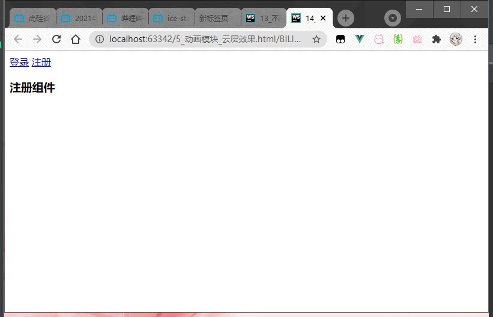


--- 


