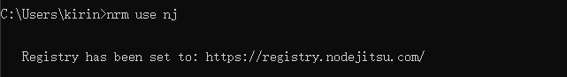

作用:提供了一些最常用的npm包镜像地址,能够让我们快速地切换安装包时候的服务器地址

1.运行`npm -i nrm -g`,全局安装`nrm`包  
2.使用`nrm ls`查看当前所有所有可用的镜像源地址以及当前所用的镜像源地址  
3.使用`npm use nom`或`nrm use taobao`切换不同的镜像源地址  

注意:nrm只是简单地提供了几个下载包的地址,方便我们切换,但是我们每次装包的工具但是npm