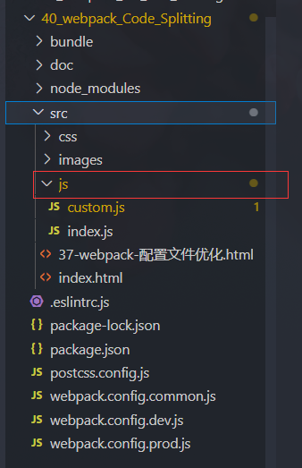

> 1.什么是Code-Splitting(代码分割)?  
默认情况下webpack会将所有引入的模块都打包到一个文件中,  
这样就导致了打包后的文件比较大, 以及修改文件后用户需要重新下载所有打包内容问题  

* 例如: 在a.js中引入了b.js, 那么a.js和b.js都会被打包到bundle.js中  
      如果a.js有1MB, b.js也有1MB, 那么打包之后的文件就有2MB  
      那么用户第一次打开网页的时候就需要下载2MB的文件  
      问题的关键在于, 如果我们修改了a.js, 但没有修改b.js  
      重新打包后用户需要重新下载新打包的文件(因为用户本地缓存的是a和b的合体)  
      这样就导致了每次修改了其中一个文件用户都要重新下载所有内容  
解决方案: 将不经常修改的内容打包到另一个文件中, 这样每次修改后用户就只用下载修改后的文件  
          没有被修改的文件由于用户上一次打开已经缓存在了本地就不用下载了, 这样性能也提升了  
Code-Splitting就是将不经常修改的模块打包到单独的文件中, 避免每次修改用户都需要重新下载所有内容  

> 2.如何开启Code-Splitting  
2.1手动分割(了解)  
- 在单独文件中引入模块, 将模块中的内容添加到window上  
- 修改配置文件同时打包多个文件  

```entry: {
    calculate: "./src/js/calculate.js", // 先打包会被先引入
    main: "./src/js/index.js",
},
output: {
    filename: "js/[name].js",
    path: path.resolve(__dirname, "bundle")
},
```

2.2自动分割  
webpack会自动判断是否需要分割, 如果需要会自动帮助我们风格
```
optimization: {
    splitChunks: {
        chunks: "all"
    }
},
```

---

> 操作:
在模板js下创建一个`custome.js`,并在其中引入:
```javascript
import $ from 'jquery';
window.$ = $;
```
说明:将jquery暴露给`windows`,index.js在使用jquery时,可以使用:
```javascript
window.$('body').css({ width: '100%', height: '100%', background: 'red' });
```


  

然后,在`webpack.config.common.js`中配置入口,出口:
```
    // 改为两个入口,指定将来在打包是打包为两个文件
    entry: {
        other: './src/js/custom.js',
        main: './src/js/index.js',
    },
```
```
    output: {
        /*
            filename: 指定打包之后的JS文件的名称
            [name]是指定打包后的文件名为指定的key值
            * */
        filename: 'js/[name].js',
        /*
        path: 指定打包之后的文件存储到什么地方
        * */
        path: path.resolve(__dirname, 'bundle')
    },
```

### 但是吧,这种做法是很麻烦的,而且不够专业,

专业做法:

把入口的这个给注释掉:
```
other: './src/js/custom.js',
```

在`webpack.config.common.js`中添加配置:
```
    // 告诉webpack需要对代码进行分割
    optimization: {
        splitChunks: {
            chunks: 'all',
        }
    },
```
之后,在index.js中引用jquery也会自动对它进行分割