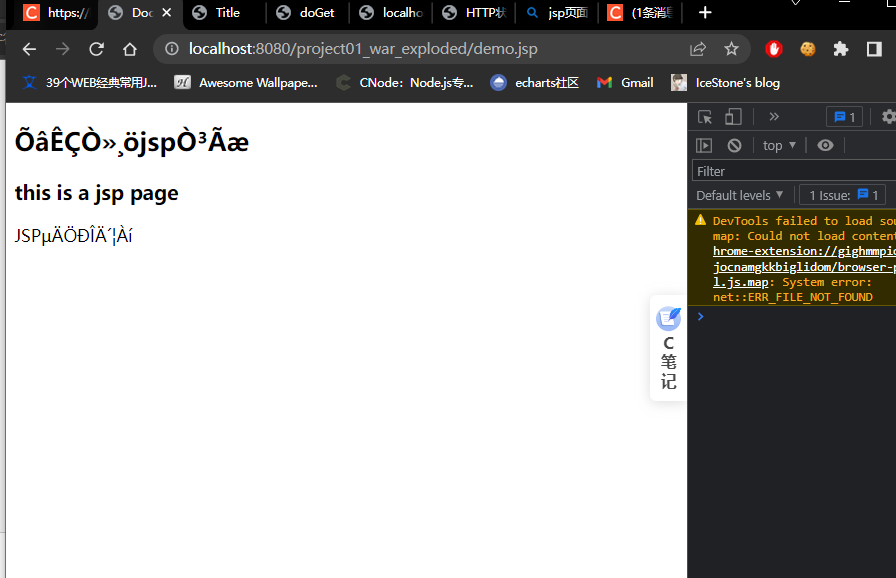
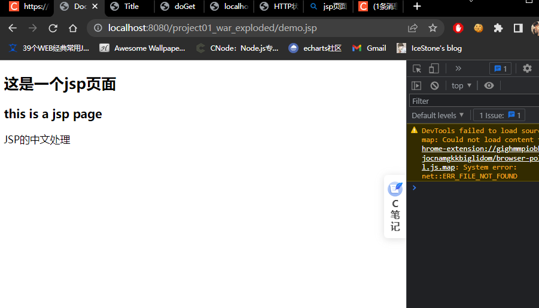

#### 如图,乱码:



#### 解决

在jsp文件的头部设置编码格式:`<%@ page contentType="text/html; charset=gb2312"%>`

代码:

```jsp
<%@ page contentType="text/html; charset=gb2312"%>
<!doctype html>
<html lang="en">
<head>
    <meta charset="UTF-8">
    <meta name="viewport"
          content="width=device-width, user-scalable=no, initial-scale=1.0, maximum-scale=1.0, minimum-scale=1.0">
    <meta http-equiv="X-UA-Compatible" content="ie=edge">
    <title>Document</title>
</head>
<body>

<h2>这是一个jsp页面</h2>
<h3>this is a jsp page</h3>
<%out.print("JSP的中文处理");%>

</body>
</html>
```

运行:




