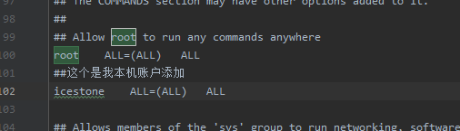
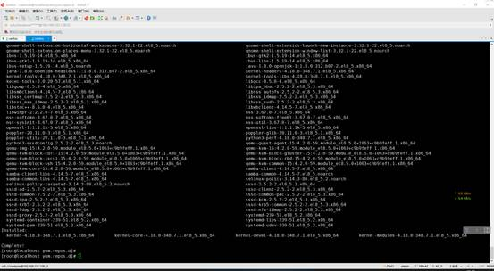
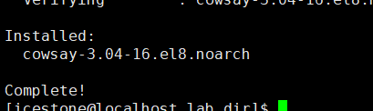
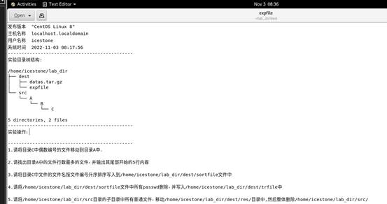

### 之前linux课上实验遇到的问题

##### 1.准备linux环境和软件:

这里使用的是centos8.5的镜像,使用xshell和xftp进行命令行输入和文件传输

在下用户home目录下新建文件夹:

 

\1.  [icestone@localhost ~]$ pwd 

\2.  /home/icestone 

\3.  [icestone@localhost ~]$ mkdir lab_dir 

\4.  [icestone@localhost ~]$ ll 

\5.  total 0 

\6.  drwxr-xr-x. 2 icestone icestone 6 Nov 2 06:32 Desktop 

\7.  drwxr-xr-x. 2 icestone icestone 6 Nov 2 06:32 Documents 

\8.  drwxr-xr-x. 2 icestone icestone 6 Nov 2 06:32 Downloads 

\9.  drwxrwxr-x. 2 icestone icestone 6 Nov 2 06:49 lab_dir 

\10. drwxr-xr-x. 2 icestone icestone 6 Nov 2 06:32 Music 

\11. drwxr-xr-x. 2 icestone icestone 6 Nov 2 06:32 Pictures 

\12. drwxr-xr-x. 2 icestone icestone 6 Nov 2 06:32 Public 

\13. drwxr-xr-x. 2 icestone icestone 6 Nov 2 06:32 Templates 

\14. drwxr-xr-x. 2 icestone icestone 6 Nov 2 06:32 Videos 

\15. [icestone@localhost ~]$  

进入该目录,使用xftp将文件传入:

 

\1.  [icestone@localhost lab_dir]$ ll 

\2.  total 20 

\3.  -rw-rw-r--. 1 icestone icestone 17600 Nov 2 06:51 preparelab.exe 

 

##### 2.安装上cowsay和fortune两个软件包

使用下面命令:

\1.  [icestone@localhost lab_dir]$ sudo yum install cowsay 

权限不够:

\1.  icestone is not in the sudoers file. This incident will be reported.

更改sudo权限:

\1.  [icestone@localhost lab_dir]$ su root 

\2.  Password:  

\3.  [root@localhost lab_dir]# cd /etc 

\4.  [root@localhost etc]# chmod +777 sudoers 

然后需要修改sudoers文件,这里我使用的连接ide修改:

修改 /etc/sudoers 

添加:

\1.  ##这个是我本机账户添加 

\2.  icestone  ALL=(ALL)  ALL 

保存,然后修改 sudoers 的权限为440:

\1.  [root@localhost etc]# chmod +777 sudoers 

查看权限:

\1.  [root@localhost etc]# ls -l /etc/sudoers 

\2.  -r--r-----. 1 root root 4385 Nov 2 07:03 /etc/sudoers 

 

切回icestone(普通用户)继续安装软件:

\1.  [icestone@localhost lab_dir]$ sudo yum install cowsay 

\2.  [sudo] password **for** icestone:  

\3.  CentOS Linux 8 - AppStream                                                                  75 B/s | 38 B   00:00   

\4.  Error: Failed to download metadata **for** repo 'appstream': Cannot prepare internal mirrorlist: No URLs in mirrorlist 

镜像源问题,更换镜像源:

进入 cd /etc/yum.repos.d/ 该目录,修改镜像源配置并生成缓存:

\1.  [icestone@localhost lab_dir]$ su root 

\2.  Password:  

\3.  [root@localhost lab_dir]# cd /etc/yum.repos.d/ 

\4.  [root@localhost yum.repos.d]# sed -i 's/mirrorlist/#mirrorlist/g' /etc/yum.repos.d/CentOS-* 

\5.  [root@localhost yum.repos.d]# sed -i 's|#baseurl=http://mirror.centos.org|baseurl=http://vault.centos.org|g' /etc/yum.repos.d/CentOS-* 

\6.  [root@localhost yum.repos.d]# yum makecache 

\7.  CentOS Linux 8 - AppStream                                                                  2.4 MB/s | 8.4 MB   00:03   

\8.  CentOS Linux 8 - BaseOS                                                                   1.6 MB/s | 4.6 MB   00:02   

\9.  CentOS Linux 8 - Extras                                                                   5.2 kB/s | 10 kB   00:02   

\10. Last metadata expiration check: 0:00:01 ago on Wed 02 Nov 2022 07:12:10 AM PDT. 

\11. Metadata cache created. 

\12. [root@localhost yum.repos.d]# yum update -y 

\13. Last metadata expiration check: 0:00:10 ago on Wed 02 Nov 2022 07:12:10 AM PDT.

镜像源换了,切回icestone账户继续装软件:

安装时报错找不着包:

\1.  [icestone@localhost lab_dir]$ sudo yum install cowsay 

\2.  [sudo] password **for** icestone:  

\3.  Last metadata expiration check: 0:08:25 ago on Wed 02 Nov 2022 07:12:10 AM PDT. 

\4.  No match **for** argument: cowsay 

安装依赖源:

\1.  [icestone@localhost lab_dir]$ sudo yum install epel-release 

\2.  Last metadata expiration check: 0:09:22 ago on Wed 02 Nov 2022 07:12:10 AM PDT. 

\3.  Dependencies resolved.

安装成功之后继续安装cowsay

\1.  [icestone@localhost lab_dir]$ sudo yum install cowsay 

\2.  Extra Packages **for** Enterprise Linux 8 - x86_64                                                        5.3 MB/s | 13 MB   00:02   

\3.  Extra Packages **for** Enterprise Linux Modular 8 - x86_64                                                    388 kB/s | 733 kB   00:01   

\4.  Last metadata expiration check: 0:00:01 ago on Wed 02 Nov 2022 07:21:48 AM PDT. 

\5.  Dependencies resolved. 

成功

然后安装fortune-mod :

\1.  [icestone@localhost lab_dir]$ sudo yum install fortune-mod 

\2.  Last metadata expiration check: 0:03:34 ago on Wed 02 Nov 2022 07:21:48 AM PDT. 

\3.  Dependencies resolved. 

##### 3.执行exe文件:

更改其权限并执行:

\1.  [icestone@localhost lab_dir]$ chmod 777 preparelab.exe 

\2.  [icestone@localhost lab_dir]$ ./preparelab.exe 

\3.  --------------------------------- 

\4.  本脚本将创建实验1所需目录及文件！ 

\5.  --------------------------------- 

\6.  目录: /home/icestone/lab_dir 已存在! 

\7.  需要先删除，是否删除(Y/N)?y 

\8.  重新创建目录结构(Y/N)?y 

\9.  expfile.tar.gz的解压密码包含在/home/icestone/lab_dir/dest/datas.tar.gz中的一个文件里 

\10. /home/icestone/lab_dir目录结构创建完成！ 

\11. /home/icestone/lab_dir 

\12. ├── dest 

\13. │  ├── datas.tar.gz 

\14. │  └── expfile.tar.gz 

\15. └── src 

\16.   └── A 

\17.     └── B 

\18.       └── C 

\19.  

\20. 5 directories, 2 files 

当前目录结构:

\1.  [icestone@localhost lab_dir]$ ll 

\2.  total 0 

\3.  drwxrwxr-x. 2 icestone icestone 48 Nov 2 07:27 dest 

\4.  drwxrwxr-x. 3 icestone icestone 15 Nov 2 07:27 src 

\5.  [icestone@localhost lab_dir]$ pwd 

\6.  /home/icestone/lab_dir 

修改C的权限:

\1.  [icestone@localhost B]$ ll 

\2.  total 0 

\3.  dr--r--r--. 2 icestone icestone 6 Nov 2 07:27 C 

\4.  [icestone@localhost B]$ cd C 

\5.  bash: cd: C: Permission denied 

\6.  [icestone@localhost B]$ pwd 

\7.  /home/icestone/lab_dir/src/A/B 

\8.  [icestone@localhost B]$ sudo chmod 777 C 

\9.  [icestone@localhost B]$ ll 

\10. total 0 

\11. drwxrwxrwx. 2 icestone icestone 6 Nov 2 07:27 C 

修改dest目录下压缩文件的权限,后面解压会用:

\1.  [icestone@localhost dest]$ sudo chmod 777 /home/icestone/lab_dir/dest/* 

\2.  [icestone@localhost dest]$ ll 

\3.  total 24 

\4.  -rwxrwxrwx. 1 icestone icestone 16576 Nov 2 07:27 datas.tar.gz 

\5.  -rwxrwxrwx. 1 icestone icestone  672 Nov 2 07:27 expfile.tar.gz 

将文件复制到/home/icestone/lab_dir/dest/A/B/C文件夹下;

\1.  [icestone@localhost dest]$ cp datas.tar.gz ../src/A/B/C 

\2.  [icestone@localhost dest]$ cp expfile.tar.gz ../src/A/B/C 

 

\1.  [icestone@localhost C]$ ll 

\2.  total 24 

\3.  -rwxrwxr-x. 1 icestone icestone 16576 Nov 2 07:38 datas.tar.gz 

\4.  -rwxrwxr-x. 1 icestone icestone  672 Nov 2 07:38 expfile.tar.gz 

\5.  [icestone@localhost C]$ pwd 

\6.  /home/icestone/lab_dir/src/A/B/C 

加密解压文件:

\1.  [icestone@localhost dest]$ openssl des3 -d -pbkdf2 -k b8bbc0e3 -in ~/lab_dir/dest/expfile.tar.gz | tar xzvf - 

\2.  expfile 

\3.  [icestone@localhost dest]$ ll 

\4.  total 24 

\5.  -rw-rw-r--. 1 icestone icestone 16179 Nov 3 08:17 datas.tar.gz 

\6.  -rw-rw-r--. 1 icestone icestone 1067 Nov 3 08:17 expfile 

\7.  -rw-rw-r--. 1 icestone icestone  664 Nov 3 08:17 expfile.tar.gz 

 

 